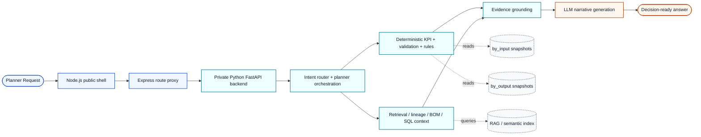
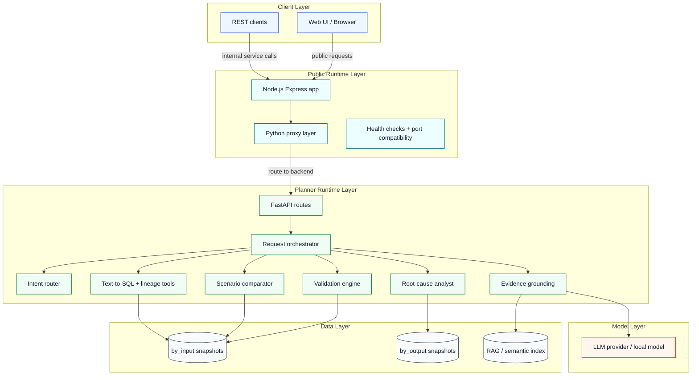
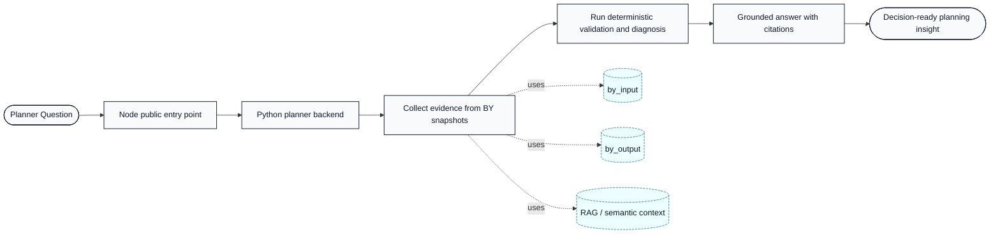

<p align="center">
  
</p>

<h1 align="center">Intel Foundry Supply Planning AI Assistant</h1>

<p align="center">
  Enterprise-grade explainability for BY ESP planning snapshots
</p>

<p align="center">
  <a href="https://github.com/jyotiranjanojha/ifsupplystory/actions/workflows/semantic-regression.yml">
    
  </a>
  <a href="https://github.com/jyotiranjanojha/ifsupplystory/actions/workflows/semantic-regression.yml">
    
  </a>
  
  
</p>

<p align="center">
  
  
  
</p>

---

## Why This Project

This assistant helps planners ask natural-language questions and receive grounded answers using:

- Deterministic planning logic for KPIs, validation, and constraints
- Structured retrieval over BY input and output snapshots
- LLM-based intent understanding and explanation generation
- Evidence-first responses with citations and confidence metadata

Built for planning teams that need explainability, traceability, and operational confidence.

### Key Capabilities

- Demand and supply diagnosis
- Scenario comparison and delta ranking
- Root-cause explainability for shortages and lateness
- Validation gates for master data and solver outputs
- BOM and lineage traversal workflows
- Text-to-SQL exploration with safety checks
- Optional RAG-backed evidence retrieval

### Executive Summary

| Focus Area | Description |
|---|---|
| Explainability | Deterministic evidence and auditable response grounding |
| Planning Intelligence | Intent-driven workflow routing and domain-aware analysis |
| Data Foundation | BY snapshot integration across by_input and by_output |
| Delivery | API-first service with web UI and semantic quality gates |

---

## Quick Navigation

- [Tech Stack](#tech-stack)
- [Model Support](#model-support)
- [Architecture](#architecture)
- [Core Components](#core-components)
- [Data Sources](#data-sources)
- [API Endpoints](#api-endpoints)
- [Getting Started](#getting-started)
- [Configuration](#configuration)
- [Testing](#testing)
- [Semantic Regression](#semantic-regression)
- [Troubleshooting](#troubleshooting)
- [Additional Documentation](#additional-documentation)

---

## At a Glance

| Category | Stack |
|---|---|
| Public Entry Point | Node.js + Express |
| Planning Engine | Python + FastAPI + Uvicorn |
| Data | BY ESP CSV snapshots (by_input and by_output) |
| Explainability | Deterministic KPI, rule, and lineage engines plus grounded LLM narratives |
| Runtime Pattern | Hybrid compatibility shell: public Node app, private Python backend |
| Quality Gate | Semantic regression with CI thresholds |

---

## Tech Stack

<p>
  
  
  
  
  
  
  
  
  
  
  
  
</p>

| Layer | Technology | Icon |
|---|---|---|
| Public API Shell | Node.js + Express |   |
| Planning Backend | FastAPI |  |
| Runtime Language | Python 3.11+ |  |
| API Server | Uvicorn |  |
| Container Runtime | Docker / Compose |  |
| Data Processing | Pandas and NumPy |   |
| Validation Models | Pydantic |  |
| Workflow Orchestration | LangGraph and domain orchestrators |  |
| Testing | pytest |  |
| Semantic Quality Gate | Custom semantic regression framework |  |
| Vector and Retrieval | FAISS-based vector storage and RAG indexing |   |
| Frontend | HTML templates with JavaScript client |   |

## Model Support

The service supports multiple LLM providers for planner-facing explanation workflows.

### Supported Providers

| Provider | Typical Use |
|---|---|
| nollama | Local OpenAI-compatible inference |
| openai | Hosted OpenAI models |
| azure | Azure OpenAI deployments |
| anthropic | Claude-based hosted inference |
| openvino | Local optimized inference workflows |
| custom | Organization-specific adapter path |

### Model Configuration

Set provider and model in .env. Example for local Nollama:

```dotenv
LLM_PROVIDER=nollama
NOLLAMA_BASE_URL=http://localhost:8000
NOLLAMA_MODEL=Qwen2.5-Coder-7B-Instruct@GPU
```

Runtime checks:

- GET /api/llm/models returns discoverable models
- GET /api/config returns active runtime configuration

For provider-specific setup details, see LLM_PROVIDER_GUIDE.md.

---

## Architecture

### High-Level Flow



### Runtime Components



### Executive View (One-Page)



---

## Core Components

| Area | Responsibility |
|---|---|
| Node Public Shell | Express layer for public-facing API and host compatibility |
| Python Backend | FastAPI planning engine, routes, and deterministic logic |
| Orchestration | Intent-driven workflow routing and response assembly |
| Intent Router | Intent catalog, entities, confidence handling |
| KPI Engine | Deterministic KPI calculations and checks |
| BOM Workflow | Multi-step BOM traversal and evidence synthesis |
| SQL Agent | NL-to-SQL pipeline with validation and retries |
| Grounding | Evidence envelope, citations, confidence mapping |
| RAG | Indexing and retrieval over planning assets |

---

## Data Sources

### BY Input Snapshot Folder: by_input

Contains planning master and policy inputs such as:

- Items, locations, calendars
- BOM and alternates
- Production and purchase methods
- Sourcing policies
- Inventory and customer orders

### BY Output Snapshot Folder: by_output

Contains solver outcomes such as:

- Demand views and links
- Planned orders and purchases
- Resource load details and exceptions
- SKU-level projection and exception outputs

### Integration Scope

- Read-only explainability over exported BY ESP snapshots
- No write-back to BY ESP from this service
- Uses BY naming and linkage conventions for joins and context resolution

---

## API Endpoints

| Method | Endpoint | Purpose |
|---|---|---|
| GET | /api/health | Service health |
| GET | /api/config | Active semantic mode and diagnostics |
| GET | /api/datasets/summary | Dataset inventory summary |
| GET | /api/llm/models | Available model list |
| POST | /api/validate | Validation checks |
| POST | /api/compare | Scenario comparison |
| POST | /api/root-cause | Root-cause analysis |
| POST | /api/sql-query | Natural language to SQL |
| POST | /api/chat | Non-streaming chat |
| POST | /api/chat/stream | Streaming chat (SSE) |
| POST | /api/rag/reindex | Build or rebuild RAG index |
| POST | /api/rag/query | Query RAG |

For the complete endpoint set, see webapp/app/main.py.

---

## Getting Started

### Prerequisites

- Windows, Linux, or macOS
- Python 3.11+
- pip

### Setup Environment

```bash
python -m venv .venv

# Windows PowerShell
.venv\Scripts\Activate.ps1

# Linux or macOS
source .venv/bin/activate

pip install --upgrade pip
pip install -r webapp/requirements.txt
```

### Create Environment File

```bash
# Windows PowerShell
Copy-Item .env.example .env

# Linux or macOS
cp .env.example .env
```

### Minimum Required Settings

```dotenv
LLM_PROVIDER=nollama
NOLLAMA_BASE_URL=http://localhost:8000
NOLLAMA_MODEL=Qwen2.5-Coder-7B-Instruct@GPU
SEMANTIC_MODE=legacy
```

### Run the Application

The current runtime pattern is a hybrid deployment:

- Public entry point: Node.js app on port 3004
- Private planning engine: Python FastAPI app on an internal port such as 8000, 8001, or 8002

#### Start the Python backend

```bash
# Windows PowerShell
.\.venv\Scripts\Activate.ps1
python webapp/run.py --host 127.0.0.1 --port 8000
```

#### Start the public Node shell

```bash
npm install
npm start
```

Then open in browser: http://localhost:3004

For containerized deployment, the project also supports a combined startup script and Docker Compose flow with the backend kept internal-only while the public Express app serves the front door.

---

## Configuration

### Semantic Mode Rules

- SEMANTIC_MODE is required
- Exactly one value must be set
- Allowed values:
  - legacy
  - semantic_retrieval
  - hybrid
  - solver_explainability

### Optional Security Controls

```dotenv
API_AUTH_ENABLED=false
API_AUTH_TOKEN=
RATE_LIMIT_ENABLED=false
RATE_LIMIT_WINDOW_SECS=60
RATE_LIMIT_PER_WINDOW=120
RATE_LIMIT_STRICT_PER_WINDOW=30
```

---

## Testing

### Run Full Test Suite

```bash
pytest tests -q
```

### Run Focused Suites

```bash
pytest tests/test_semantic_mode_config.py -q
pytest tests/test_kpi_engine.py -q
pytest tests/test_hybrid_router.py -q
pytest tests/semantic -rA
```

Current workspace baseline:

- 65 passed
- 2 skipped

---

## Semantic Regression

This repository includes a semantic quality gate designed to validate semantic behavior independently from LLM narration.

### Important Assets

- Gold dataset: tests/semantic/gold_semantic_dataset.json
- Snapshots: tests/semantic/snapshots/semantic_snapshots.json
- Runner: tests/semantic/run_semantic_regression.py
- Evaluator: webapp/app/semantic_regression.py
- Reports: reports/semantic_report.json and reports/semantic_report.html

### Quality Gates

- Intent Accuracy >= 95%
- File Mapping Accuracy >= 95%
- KPI Accuracy >= 90%
- Hallucination Rate = 0%

### Run Gate Locally

```bash
python tests/semantic/run_semantic_regression.py
```

### Intentional Snapshot Update

```bash
python tests/semantic/run_semantic_regression.py --update-snapshots
```

---

## Planner Query Examples

- Why is demand short for item 100000000004 in week 2025W46 scenario S1?
- Compare scenario BASE vs ALT for week 2025W46 and rank KPI deltas.
- Which resource constraints contributed most to late demand for item 2000-293-667?
- Show end-of-horizon inventory and safety stock gap for product family X at site Y.
- Validate BOM traversal and production-route readiness for week 2025W46 scenario S2.

---

## Deterministic vs LLM Responsibilities

### Deterministic Engines

- Data selection and retrieval
- KPI calculations
- Rule evaluation and severity logic
- Constraint signal derivation

### LLM Layer

- Understand planner intent and wording
- Refine semantic planning payloads by mode
- Generate concise explanations grounded in deterministic evidence

---

## Troubleshooting

| Symptom | Checks |
|---|---|
| Startup fails with semantic mode error | Set exactly one valid SEMANTIC_MODE in .env and remove deprecated semantic flags |
| Generic or low-quality chat output | Verify by_input and by_output data availability; include week, scenario, site, and item context; refresh the RAG index if stale |
| Provider connectivity issues | Validate provider environment variables, confirm endpoint availability, and call /api/llm/models |
| Streaming disconnects | Use a stable SSE network path and disable reverse proxy buffering for SSE deployments |

---

## Project Structure

This repository is organized into a few easy-to-understand areas:

| Folder or File | What It Is For |
|---|---|
| README.md | Main guide to understand and run the project |
| BY_ESP_QUERY_CATALOG.csv | Reference list of planning query patterns |
| by_input | Input planning data snapshots (what goes into planning) |
| by_output | Output planning snapshots (what comes out of planning) |
| docs | Deep-dive documentation and architecture notes |
| tests | Automated checks to confirm quality and correctness |
| webapp | The actual application (API service plus web interface) |

Inside webapp:

| Folder or File | What It Is For |
|---|---|
| run.py | Starts the application |
| requirements.txt | Python dependencies needed to run |
| app | Core backend logic and APIs |
| app/templates | Web page templates |
| app/static | Frontend assets (JavaScript, images, styles) |

---

## Additional Documentation

- webapp/README.md
- docs/README.md
- LLM_PROVIDER_GUIDE.md
- MULTI_PROVIDER_IMPLEMENTATION.md
- TEAMS_AGENT_DEPLOYMENT.md
- PRD.md

---

## License and Usage

Use according to your organization and repository policies. This assistant is intended for grounded planning explainability and analytical workflows over approved dataset snapshots.
