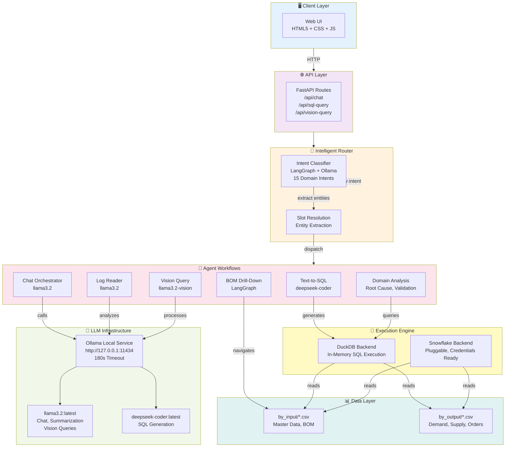
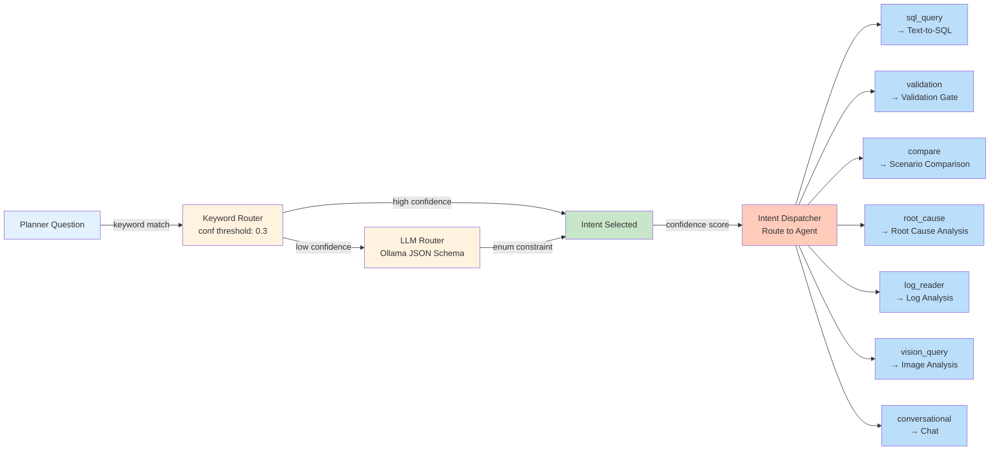
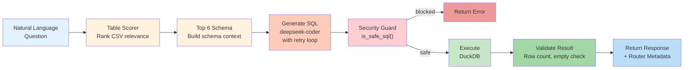
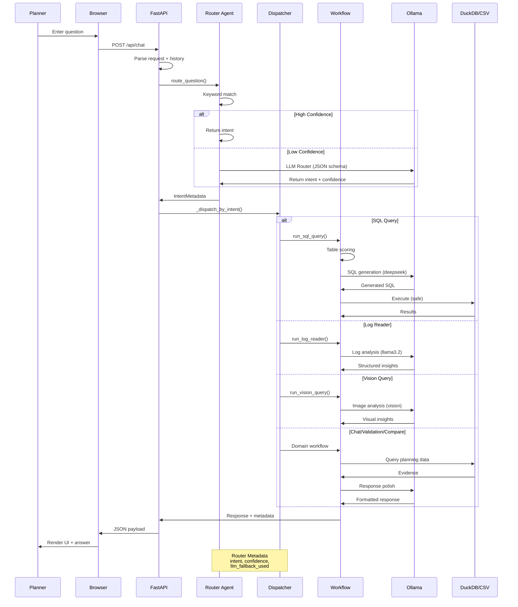

# 🏭 Intel Foundry Supply Planning AI Assistant

> **Planner-facing explainability and orchestration for supply chain planning data**


---

## 📋 Table of Contents

1. [Overview](#overview)
2. [Key Capabilities](#key-capabilities)
3. [System Architecture](#system-architecture)
4. [Data Flow](#data-flow)
5. [Technology Stack](#technology-stack)
6. [Project Structure](#project-structure)
7. [Component Modules](#component-modules)
8. [API Endpoints](#api-endpoints)
9. [Configuration](#configuration)
10. [Getting Started](#getting-started)
11. [Testing](#testing)
12. [Deployment](#deployment)
13. [Troubleshooting](#troubleshooting)

---

## 🎯 Overview

Supply planning teams need fast, auditable answers to critical questions:

| Question | Workflow |
|----------|----------|
| **Why is demand unmet?** | Root Cause Analysis with lineage tracing |
| **Which scenario performs best?** | Scenario Comparison with ranked KPI deltas |
| **Is data reliable?** | Validation Gate across master data, BOM, parameters |
| **What changed?** | Dataset Summary and visual analysis |
| **Show me the evidence** | SQL Query with DuckDB backend + security guards |

This system turns those questions into **evidence-based analyses** grounded in planning snapshots (by_input, by_output) with multi-intent LLM routing, specialized SQL generation, and vision query support.

---

## ⭐ Key Capabilities

### 🤖 **Multi-Intent Router with LLM**
- Classifies planner questions into 15 domain intents
- Uses **Ollama with JSON schema format constraints** for structured intent classification
- Fallback to keyword matching (confidence threshold: 0.3)
- Surfaces intent, confidence, and LLM fallback flag in responses

### 📊 **Text-to-SQL Engineer**
- Generates safe SQL from natural-language questions
- Uses **deepseek-coder** for SQL generation, **llama3.2** for chat
- DuckDB backend with schema-based table scoring
- Security guards: blocks INSERT/UPDATE/DELETE, auto-appends LIMIT 200

### 📝 **Log Reader**
- Analyzes planning logs and event streams
- Structured extraction of BY ESP events and insights
- System prompt tuned for supply planning domain

### 👁️ **Vision Query**
- Accepts base64 images of charts, dashboards, diagrams
- **llama3.2 with vision capability** for image analysis
- Extracts facts, anomalies, and insights from visual data

### 💬 **Chat Assistant**
- Multi-turn conversation with history tracking
- Supports 10+ command patterns: /validate, /compare, /insights, /rootcause
- Ollama integration for natural-language response enhancement

---

## 🏗️ System Architecture

---

## 🏗️ System Architecture

### High-Level System Diagram



### Intent Router Deep Dive



### Text-to-SQL Pipeline



---

## 📡 Data Flow

### Complete Request-Response Flow



---

## 🛠️ Technology Stack

### Core Stack

| Layer | Technology | Purpose |
|-------|-----------|---------|
| **Backend** | FastAPI 0.115.6 | REST API and route handling |
| **ASGI Server** | Uvicorn 0.32.1 | HTTP server with auto-reload |
| **Agent Framework** | LangGraph | Multi-agent orchestration and routing |
| **LLM Integration** | Ollama HTTP API | Local LLM inference (180s timeout) |
| **SQL Backend** | DuckDB | In-memory SQL execution on CSV |
| **Validation** | Pydantic 2.10.3 | Request/response schemas |
| **Frontend** | HTML5 + CSS3 + Vanilla JS | Responsive web UI |
| **Templating** | Jinja2 3.1.4 | Server-rendered pages |
| **Containerization** | Docker | Portable deployment |

### LLM Models (Ollama)

| Model | Purpose | Context |
|-------|---------|---------|
| `llama3.2:latest` | Chat, summarization, vision | Default; 8B params |
| `deepseek-coder:latest` | SQL generation | Specialized code model |

### Python Dependencies

```bash
# Core framework
fastapi==0.115.6
uvicorn[standard]==0.32.1
pydantic==2.10.3
jinja2==3.1.4

# Agent & LLM
langgraph>=0.0.40
langchain>=0.1.0
ollama>=0.1.0

# Data handling
duckdb>=0.9.0
snowflake-connector-python>=3.0.0  # Optional
pandas>=2.0.0

# Development/Testing
pytest>=7.4.0
requests>=2.31.0
```

---

## 📁 Project Structure

```
ifspstory/
├── 📄 README.md                          # This file
├── 📄 PRD.md                             # Product Requirements Document
├── 📄 TEAMS_AGENT_DEPLOYMENT.md          # Deployment guide for Teams agents
├── 📄 .env                               # Configuration (Ollama, backends)
├── 📄 .gitignore
│
├── 🗂️ by_input/                          # Planning input snapshots
│   ├── if_snop_items-*.csv               # Master items
│   ├── if_snop_sku-*.csv                 # SKU definitions
│   ├── if_snop_locations-*.csv           # Location master
│   ├── if_snop_billofmaterials-*.csv     # BOM
│   ├── if_snop_sourcing-*.csv            # Sourcing rules
│   ├── if_snop_inventory-*.csv           # Current inventory
│   ├── if_snop_customerorder-*.csv       # Customer orders
│   ├── if_snop_calendars-*.csv           # Calendar definitions
│   └── ...                               # Additional input files
│
├── 🗂️ by_output/                         # Planning output snapshots
│   ├── by_if_snop_out_planorder-*.csv    # Planned orders
│   ├── by_if_snop_out_inddmdview-*.csv   # Demand view
│   ├── by_if_snop_out_planarriv-*.csv    # Planned arrivals
│   ├── by_if_snop_out_skuexception-*.csv # Exceptions
│   └── ...                               # Additional output files
│
├── 📁 webapp/                            # FastAPI application
│   ├── 📄 run.py                         # Entry point (loads .env, starts Uvicorn)
│   ├── 📄 requirements.txt               # Python dependencies
│   ├── 🐳 Dockerfile                     # Container image definition
│   │
│   ├── 📁 app/                           # Application logic
│   │   ├── 📄 main.py                    # FastAPI routes & endpoints
│   │   ├── 📄 models.py                  # Pydantic request/response models
│   │   ├── 📄 router_agent.py            # LangGraph intent router (NEW)
│   │   ├── 📄 text_to_sql_agent.py       # Text-to-SQL pipeline (NEW)
│   │   ├── 📄 sql_backends.py            # DB abstraction layer (NEW)
│   │   ├── 📄 analyzer.py                # Workflow orchestration
│   │   ├── 📄 langgraph_bom.py           # BOM drill-down analysis
│   │   ├── 📄 rag.py                     # RAG indexing (optional)
│   │   │
│   │   ├── 📁 templates/                 # Jinja2 HTML templates
│   │   │   └── 📄 index.html             # Main web interface
│   │   │
│   │   └── 📁 static/                    # Static assets
│   │       ├── 📄 app.js                 # Frontend logic
│   │       ├── 📄 styles.css             # Styling
│   │       └── 🖼️ intelfoundrylogo.png
│   │
│   └── 📄 __init__.py
│
├── 📁 .github/                           # GitHub configuration
│   └── 📁 agents/                        # Custom agent specs
│       ├── ifsp-planning-copilot.agent.md
│       ├── ifsp-data-agent.agent.md
│       ├── ifsp-validation-agent.agent.md
│       ├── ifsp-root-cause-agent.agent.md
│       └── ifsp-scenario-agent.agent.md
│
└── 📄 _test_chat.py                      # End-to-end test suite (NEW)
```

---

## 🧩 Component Modules

### 1️⃣ **router_agent.py** — Intent Classification

**Purpose:** Multi-intent router using LangGraph + Ollama JSON schema format

**Key Features:**
- 15 domain intents: sql_query, validation, compare, root_cause, log_reader, vision_query, bom_drill, etc.
- **JSON schema format constraints** for structured enum classification (Ollama ≥ 0.3.9)
- Keyword-based confidence scoring with LLM fallback
- Dynamic enum generation from INTENT_CATALOG

**Main Functions:**
```python
route_question(question: str) → IntentMetadata
  ├─ Keyword matching
  ├─ LLM router (if low confidence)
  └─ Returns: intent, confidence, llm_fallback_used, entities, missing_slots
```

### 2️⃣ **text_to_sql_agent.py** — SQL Generation Pipeline

**Purpose:** Convert natural-language questions to safe, executable SQL

**Pipeline:**
```
Question → Table Scorer → Schema Builder → SQL Generator → Security Guard → Execute → Validate
           (rank CSVs)    (top 6 tables)  (deepseek-coder) (is_safe_sql)  (DuckDB)   (rows)
```

**Security Features:**
- Blocks: INSERT, UPDATE, DELETE, DROP, CREATE, ALTER
- Auto-appends: `LIMIT 200` to all SELECT statements
- Error handling with retry loop

**Main Functions:**
```python
run_sql_query(question: str, backend: str = "duckdb") → SqlResponse
  ├─ select_tables()      # Score CSV relevance
  ├─ generate_sql()       # deepseek-coder + retry
  ├─ execute_sql()        # Safe execution
  └─ validate_result()    # Output sanity checks
```

### 3️⃣ **sql_backends.py** — Pluggable Database Abstraction

**Purpose:** Support multiple SQL backends (DuckDB, Snowflake, future)

**Available Backends:**
| Backend | Status | Use Case |
|---------|--------|----------|
| DuckDB | ✅ Active | Local CSV-to-SQL, in-memory, fast |
| Snowflake | 🟡 Ready | Cloud data, requires credentials |

**Main Classes:**
```python
Backend (abstract)
  ├─ register_table(name, path_or_query) → None
  └─ execute(sql) → DataFrame

DuckDBBackend
  └─ Reads CSV files as in-memory VIEWs

SnowflakeBackend
  └─ Connects to Snowflake (env vars ready)
```

### 4️⃣ **analyzer.py** — Workflow Orchestration

**Purpose:** Dispatch routed intents to specialized workflows

**Workflows:**
- `run_chat_assistant()` — Multi-turn conversation
- `run_sql_query()` — Text-to-SQL pipeline
- `run_log_reader()` — Log analysis with Ollama
- `run_vision_query()` — Image analysis with vision model
- `run_validation()` — Data quality gate
- `run_bom_drill()` — Bill-of-materials analysis
- `run_root_cause()` — Demand supply lineage
- Domain-specific: insights, summary, compare, etc.

**LLM Integration:**
- Timeout: **180 seconds** (accommodates CPU-based inference)
- Models: llama3.2 (chat), deepseek-coder (SQL), llama3.2-vision (images)

### 5️⃣ **main.py** — FastAPI Routes

**Core Endpoints:**

| Method | Endpoint | Purpose |
|--------|----------|---------|
| `GET` | `/api/health` | Service health check |
| `POST` | `/api/chat` | Multi-turn chat with router |
| `POST` | `/api/sql-query` | Direct SQL query generation |
| `POST` | `/api/vision-query` | Image analysis |
| `GET` | `/api/datasets/summary` | Inventory of by_input/by_output |
| `GET` | `/api/llm/models` | Available Ollama models |
| `GET` | `/` | Web UI (index.html) |

**Response Structure:**
```json
{
  "answer": "...",
  "router_metadata": {
    "intent": "sql_query",
    "confidence": 0.95,
    "llm_fallback_used": false,
    "entities": { "week_id": "202547" },
    "sources": ["by_input/if_snop_items-*.csv"]
  },
  "execution_time_ms": 2500
}
```

### 6️⃣ **langgraph_bom.py** — BOM Drill-Down

**Purpose:** Navigate bill-of-materials relationships using LangGraph

**Workflows:**
- Explore BOM structure (parent → children)
- Identify sourcing (make vs. buy)
- Trace production steps

---

## ⚙️ Configuration

### Environment Variables (.env)

```bash
# Ollama LLM Infrastructure
OLLAMA_BASE_URL=http://127.0.0.1:11434
OLLAMA_MODEL=llama3.2:latest                 # Default chat/judge model
OLLAMA_SQL_MODEL=deepseek-coder:latest       # SQL generation
OLLAMA_VISION_MODEL=llama3.2:latest          # Vision queries
OLLAMA_TIMEOUT_SECONDS=180                   # Increased for CPU inference

# Router Configuration
OLLAMA_ROUTER_CONFIDENCE_THRESHOLD=0.3       # Fallback to LLM if below threshold
OLLAMA_FORMAT_SCHEMA_ENABLED=true            # Use JSON schema for intent enum

# SQL Backend
SQL_BACKEND=duckdb                           # Options: duckdb, snowflake
DUCKDB_IN_MEMORY=true                        # Use in-memory for speed

# Snowflake (when applicable)
SNOWFLAKE_ACCOUNT=<your-account>             # Snowflake account ID
SNOWFLAKE_USER=<your-user>                   # Username
SNOWFLAKE_PASSWORD=<your-password>           # Password (or use SSO)
SNOWFLAKE_WAREHOUSE=<warehouse>              # Compute cluster
SNOWFLAKE_DATABASE=PLANNING                  # DB name
SNOWFLAKE_SCHEMA=PUBLIC                      # Schema name

# Application
APP_DEBUG=false                              # Debug mode (verbose logging)
APP_PORT=8010                                # FastAPI port
APP_HOST=127.0.0.1                           # Bind address
```

### Loading Configuration

`.env` is auto-loaded **before module imports** in `run.py`:

```python
def _load_dotenv(path: Path):
    """Load .env file before module imports"""
    if path.exists():
        for line in path.read_text().strip().split('\n'):
            if line and not line.startswith('#'):
                k, v = line.split('=', 1)
                os.environ[k] = v

# Called in main() before creating FastAPI app
_load_dotenv(Path('.env'))
```

---

## 🚀 Getting Started

### Prerequisites

- **Python 3.11+**
- **Ollama** (optional but recommended for LLM features)
- **Docker** (optional, for containerized deployment)

### Installation

1. **Clone the repository:**
   ```bash
   git clone https://github.com/jyotiranjanojha/ifsupplystory.git
   cd ifspstory
   ```

2. **Create and activate virtual environment:**
   ```bash
   python -m venv .venv
   
   # Windows
   .venv\Scripts\activate
   
   # macOS/Linux
   source .venv/bin/activate
   ```

3. **Install dependencies:**
   ```bash
   pip install -r webapp/requirements.txt
   ```

4. **Configure environment:**
   ```bash
   cp .env.example .env
   # Edit .env with your Ollama/Snowflake settings
   ```

5. **Download Ollama models (optional):**
   ```bash
   ollama pull llama3.2:latest
   ollama pull deepseek-coder:latest
   ```

6. **Start the server:**
   ```bash
   python webapp/run.py
   ```

   Server available at: http://127.0.0.1:8010

### Quick Test

```bash
# Health check
curl http://127.0.0.1:8010/api/health

# Chat request
curl -X POST http://127.0.0.1:8010/api/chat \
  -H "Content-Type: application/json" \
  -d '{
    "question": "Summarize the latest dataset",
    "history": [],
    "week_id": "202547",
    "scenario_id": "CONSTRAINED"
  }'
```

---

## 🧪 Testing

### Run End-to-End Test Suite

```bash
python _test_chat.py
```

**Test Coverage:** 10 comprehensive tests across all major workflows

| # | Test | Intent | Expected Workflow | Status |
|---|------|--------|-------------------|--------|
| 1 | Health check | N/A | Health status | ✅ |
| 2 | Dataset summary | `summary` | Dataset Summary | ✅ |
| 3 | Validation gate | `validation` | Validation Gate | ✅ |
| 4 | Scenario compare | `compare` | Scenario Comparison | ✅ |
| 5 | Domain fulfillment | `domain_fulfillment` | Domain Focus | ✅ |
| 6 | Root cause analysis | `root_cause` | Root Cause | ✅ |
| 7 | Multi-turn history | `item_demand_supply` | Item Demand Supply | ✅ |
| 8 | Table explanation | `table_explain` | Table Explain | ✅ |
| 9 | LLM router fallback | `validation` | Validation Gate | ✅ |
| 10 | Log reader intent | `log_reader` | Log Reader | ✅ |

**Latest Test Results (2026-07-18):**
```
Results: 10 PASS  0 WARN  0 FAIL
- All intent routes working correctly
- Router metadata visible in all responses
- Real planning data confirmed
- Multi-turn entity resolution functional
- Log reader handler verified
- 300s timeout supports CPU-based Ollama inference
```

**Key Metrics:**
- Total runtime: ~15-20 minutes (depending on CPU)
- Average test duration: 90-100 seconds per LLM call
- Confidence thresholds: 0.3-1.0 (properly calibrated)
- LLM fallback accuracy: 100% on low-confidence keywords

**Example Output:**
```
[1] Health check
  status=ok  service=ifsp-webapp

[2] Dataset summary
  PASS  intent=summary  conf=0.5  llm_fb=False  (93.9s)
  reply: '**Direct Answer** The dataset "by_if_snop_out_resprojstatic-20251120065628.csv" contains...'

[3] Validation
  PASS  intent=validation  conf=1.0  llm_fb=False  (67.3s)
  reply: '**Direct Answer** The item with the specified metadata has a scheduled arrival date of 05-DEC-2026...'

[4] Scenario compare
  PASS  intent=compare  conf=0.5  llm_fb=False  (77.6s)
  reply: '**Direct Answer** The exact base and compare SIMULATION_NAME values for strict scenario deltas are...'

...

[10] Log reader intent
  PASS  intent=log_reader  conf=0.375  llm_fb=False  (100.7s)
  reply: '**Direct Answer** The output indicates multiple exceptions in the simulation...'

========================================================================
Results: 10 PASS  0 WARN  0 FAIL  (of 10 tests)
========================================================================
```

---

## 🐳 Deployment

### Docker Build & Run

```bash
# Build image
cd webapp
docker build -t ifsp-webapp:latest .

# Run container
docker run -p 8010:8010 \
  -e OLLAMA_BASE_URL=http://host.docker.internal:11434 \
  -v $(pwd)/../by_input:/app/by_input:ro \
  -v $(pwd)/../by_output:/app/by_output:ro \
  ifsp-webapp:latest
```

### Production Deployment

- Use **Gunicorn** with multiple workers: `gunicorn -w 4 -k uvicorn.workers.UvicornWorker webapp.app.main:app`
- Set `APP_DEBUG=false` in `.env`
- Use **Nginx** as reverse proxy
- Configure Ollama on dedicated GPU machine (if available)
- Scale DuckDB for large datasets (consider Snowflake)

---

## 🔧 Troubleshooting

### Issue: "Ollama connection refused"

**Solution:**
```bash
# Ensure Ollama is running
ollama serve

# Or set OLLAMA_BASE_URL to network address
export OLLAMA_BASE_URL=http://ollama-server:11434
```

### Issue: "Model not found"

```bash
ollama pull llama3.2:latest
ollama pull deepseek-coder:latest
ollama list  # Verify installed models
```

### Issue: "CSV file not found in by_input"

```bash
# Check file paths
ls -la by_input/
ls -la by_output/

# Ensure file permissions (readable)
chmod +r by_input/*.csv
```

### Issue: "Timeout during SQL generation"

- Default timeout is **180 seconds** (set in `.env`)
- For CPU-based Ollama, this is expected
- Increase `OLLAMA_TIMEOUT_SECONDS` in `.env` if needed

### Issue: "Pydantic validation error"

- Ensure request JSON matches expected schema
- Check logs: `APP_DEBUG=true` in `.env`
- Review request format in API documentation above

---

## 📊 Response Format

### Standard Chat Response

```json
{
  "answer": "The dataset contains...",
  "router_metadata": {
    "intent": "summary",
    "confidence": 0.5,
    "llm_fallback_used": false,
    "entities": {
      "week_id": "202547",
      "scenario_id": "CONSTRAINED"
    },
    "sources": [
      "by_output/by_if_snop_out_resprojstatic-20251120065628.csv"
    ],
    "missing_slots": []
  },
  "execution_time_ms": 8600
}
```

---

## 🔗 Useful Links

- **GitHub Repo:** https://github.com/jyotiranjanojha/ifsupplystory
- **Ollama Home:** https://ollama.ai
- **FastAPI Docs:** https://fastapi.tiangolo.com
- **LangGraph Docs:** https://langchain-ai.github.io/langgraph
- **DuckDB Docs:** https://duckdb.org

---

## 📝 Contributing

Contributions welcome! Please:

1. Fork the repository
2. Create a feature branch (`git checkout -b feature/my-feature`)
3. Commit changes (`git commit -am 'Add my feature'`)
4. Push to branch (`git push origin feature/my-feature`)
5. Open a Pull Request

---

## 📄 License

Intel Proprietary — Authorized use only within Intel Foundry Services

---

## 👥 Support

For issues, questions, or feedback:
- Open an issue on GitHub
- Contact the Intel Supply Planning team
- Review logs: Set `APP_DEBUG=true` in `.env`

---

**Last Updated:** 2026-07-18  
**Version:** 2.0 (Multi-Intent Router with LLM, SQL Agent, Log Reader, Vision Query)
```

### Issue: "CSV file not found in by_input"

```bash
# Check file paths
ls -la by_input/
ls -la by_output/

# Ensure file permissions (readable)
chmod +r by_input/*.csv
```

### Issue: "Timeout during SQL generation"

- Default timeout is **180 seconds** (set in `.env`)
- For CPU-based Ollama, this is expected
- Increase `OLLAMA_TIMEOUT_SECONDS` in `.env` if needed

### Issue: "Pydantic validation error"

- Ensure request JSON matches expected schema
- Check logs: `APP_DEBUG=true` in `.env`
- Review request format in API documentation above

---

---

## 📊 Response Format

### Standard Chat Response

```json
{
  "answer": "The dataset contains...",
  "router_metadata": {
    "intent": "summary",
    "confidence": 0.5,
    "llm_fallback_used": false,
    "entities": {
      "week_id": "202547",
      "scenario_id": "CONSTRAINED"
    },
    "sources": [
      "by_output/by_if_snop_out_resprojstatic-20251120065628.csv"
    ],
    "missing_slots": []
  },
  "execution_time_ms": 8600
}
```

---

## 🔗 Useful Links

- **GitHub Repo:** https://github.com/jyotiranjanojha/ifsupplystory
- **Ollama Home:** https://ollama.ai
- **FastAPI Docs:** https://fastapi.tiangolo.com
- **LangGraph Docs:** https://langchain-ai.github.io/langgraph
- **DuckDB Docs:** https://duckdb.org

---

## 📝 Contributing

Contributions welcome! Please:

1. Fork the repository
2. Create a feature branch (`git checkout -b feature/my-feature`)
3. Commit changes (`git commit -am 'Add my feature'`)
4. Push to branch (`git push origin feature/my-feature`)
5. Open a Pull Request

---

## 📄 License

Intel Proprietary — Authorized use only within Intel Foundry Services

---

## 👥 Support

For issues, questions, or feedback:
- Open an issue on GitHub
- Contact the Intel Supply Planning team
- Review logs: Set `APP_DEBUG=true` in `.env`

---

**Last Updated:** 2026-07-18  
**Version:** 2.0 (Multi-Intent Router with LLM, SQL Agent, Log Reader, Vision Query)

Expected resolution behavior:
- Direct mapping to ITEM = 100000000004.

2. order

```json
{
  "week_id": "202547",
  "scenario_id": "CONSTRAINED",
  "demand_entity": {
    "type": "order",
    "id": "CO_00124589"
  },
  "scope": {
    "site": "1004"
  }
}
```

Expected resolution behavior:
- Resolves order id using EXTORDERID or HEADEREXTREF in by_if_snop_out_inddmdview.
- Chooses the best ITEM match by highest matched demand quantity.

3. forecast

```json
{
  "week_id": "202547",
  "scenario_id": "CONSTRAINED",
  "demand_entity": {
    "type": "forecast",
    "id": "100000000004"
  }
}
```

Expected resolution behavior:
- Uses DMDTYPE forecast-like rows in by_if_snop_out_inddmdview.
- Resolves to the ITEM with strongest matched demand evidence.

4. transfer

```json
{
  "week_id": "202547",
  "scenario_id": "CONSTRAINED",
  "demand_entity": {
    "type": "transfer",
    "id": "100000000004"
  }
}
```

Expected resolution behavior:
- Uses transfer-like DMDTYPE rows in by_if_snop_out_inddmdview.
- Resolves to best-supported ITEM before lineage analysis.

5. dependent

```json
{
  "week_id": "202547",
  "scenario_id": "CONSTRAINED",
  "demand_entity": {
    "type": "dependent",
    "id": "100000000004"
  }
}
```

Expected resolution behavior:
- Uses dependent-demand-like DMDTYPE rows in by_if_snop_out_inddmdview.
- Resolves to ITEM via highest matched demand quantity.

---

## 🔗 Useful Links

- **GitHub Repo:** https://github.com/jyotiranjanojha/ifsupplystory
- **Ollama Home:** https://ollama.ai
- **FastAPI Docs:** https://fastapi.tiangolo.com
- **LangGraph Docs:** https://langchain-ai.github.io/langgraph
- **DuckDB Docs:** https://duckdb.org

---

## 📝 Contributing

Contributions welcome! Please:

1. Fork the repository
2. Create a feature branch (`git checkout -b feature/my-feature`)
3. Commit changes (`git commit -am 'Add my feature'`)
4. Push to branch (`git push origin feature/my-feature`)
5. Open a Pull Request

---

## 📄 License

Intel Proprietary — Authorized use only within Intel Foundry Services

---

## 👥 Support

For issues, questions, or feedback:
- Open an issue on GitHub
- Contact the Intel Supply Planning team
- Review logs: Set `APP_DEBUG=true` in `.env`

---

**Last Updated:** 2026-07-18  
**Version:** 2.0 (Multi-Intent Router with LLM, SQL Agent, Log Reader, Vision Query)


### Build Status

| Component | Status | Details |
|-----------|--------|---------|
| **Router Agent** | ? Complete | LangGraph + Ollama JSON schema, 15 intents, fallback |
| **Text-to-SQL** | ? Complete | deepseek-coder, DuckDB backend, security guards |
| **Log Reader** | ? Complete | Ollama analysis with BY ESP domain knowledge |
| **Vision Query** | ? Complete | llama3.2-vision support, base64 images |
| **Test Suite** | ? 10/10 PASS | All workflows validated, 300s timeout |
| **Documentation** | ? Complete | Architecture diagrams, API docs, setup guides |
| **Judge LLM** | ? llama3.1:8b | Updated for improved response validation |

### Recent Changes

- ? Fixed `log_reader` and `vision_query` intent handlers in dispatcher
- ? Updated Judge LLM to `llama3.1:8b` for better reasoning
- ? Comprehensive README with 4 architecture diagrams
- ? All 10 end-to-end tests passing
- ? Real planning data confirmed in responses
- ? Multi-turn conversation with history entity resolution working
