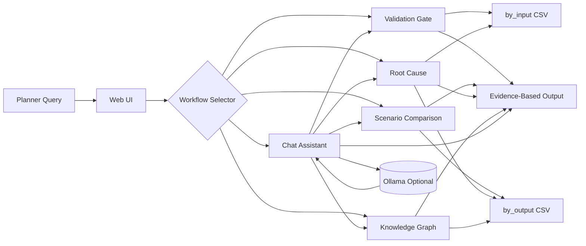
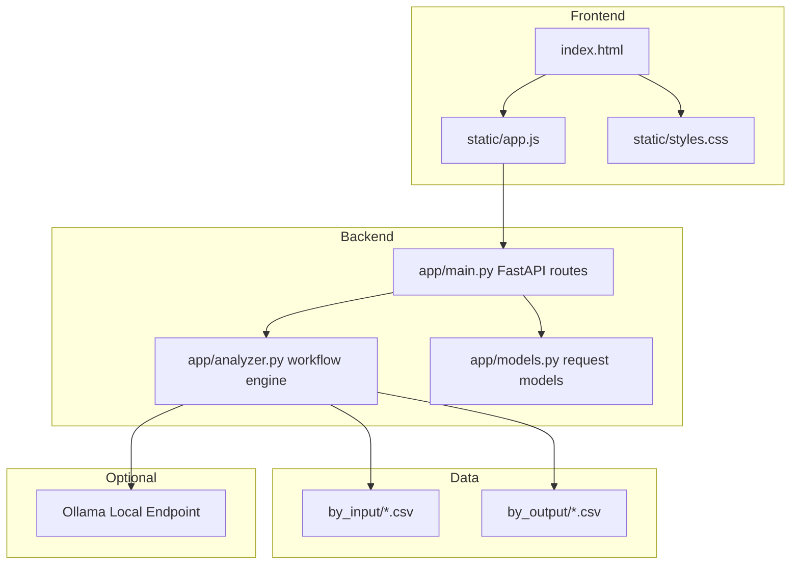
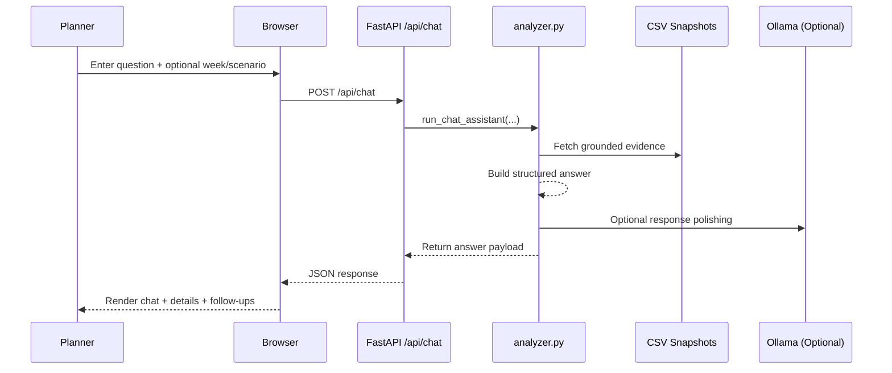

# Intel Foundry Planning AI Assistant


Planner-facing explainability workspace for Blue Yonder ESP-style planning data.

This project delivers a unified planner workbench for:
- Validation Gate
- Scenario Comparison
- Root Cause Explainability
- Knowledge Graph lineage view
- Chat Assistant with optional Ollama-enhanced response formatting

## Table Of Contents

1. [Project Overview](#project-overview)
2. [Technology Stack](#technology-stack)
3. [Architecture Graphics](#architecture-graphics)
4. [Repository Structure](#repository-structure)
5. [Functional Modules](#functional-modules)
6. [Data Model And Conventions](#data-model-and-conventions)
7. [API Reference](#api-reference)
8. [Local Development Setup](#local-development-setup)
9. [Docker Deployment](#docker-deployment)
10. [Agent Suite](#agent-suite)
11. [Troubleshooting](#troubleshooting)
12. [Roadmap](#roadmap)

## Project Overview

Planning teams need fast, auditable answers to recurring questions:
- Why is demand unmet for a specific item and week?
- Which scenario performs better, and what changed?
- Are input master data and planning parameters reliable before trusting outputs?

This app turns those questions into workflow-driven analyses grounded in local planning snapshots under by_input and by_output.

## Technology Stack

### Full Stack Matrix

| Layer | Technology | Version / Type | Where Used |
|---|---|---|---|
| Language | Python | 3.11+ runtime in container, local 3.x supported | API, analytics, orchestration |
| Web Framework | FastAPI | 0.115.6 | REST routes and request handling |
| ASGI Server | Uvicorn | 0.32.1 | Local server and production entrypoint |
| Validation / Schemas | Pydantic | 2.10.3 | Request and response model typing |
| Templating | Jinja2 | 3.1.4 | Server-rendered HTML shell |
| Frontend | HTML5 + CSS3 + Vanilla JavaScript | Native | UI layout, interactions, rendering |
| Static Serving | Starlette StaticFiles (via FastAPI) | Framework built-in | CSS, JS, images |
| Data Source | CSV snapshots | Pipe-delimited files | by_input and by_output analytics |
| Optional LLM | Ollama HTTP API | Optional local service | Chat natural-language summarization |
| Containerization | Docker | Dockerfile-based | Portable deployment |
| Agent Configuration | GitHub Copilot custom agent specs | Markdown config files | Planner workflow orchestration |

### Python Dependencies

From webapp/requirements.txt:
- fastapi==0.115.6
- uvicorn[standard]==0.32.1
- jinja2==3.1.4
- pydantic==2.10.3

## Architecture Graphics

### End-To-End Workflow



### Application Architecture



### Runtime Sequence (Chat Example)



## Repository Structure

```text
ifspstory/
  .github/
    agents/
      ifsp-planning-copilot.agent.md
      ifsp-data-agent.agent.md
      ifsp-validation-agent.agent.md
      ifsp-root-cause-agent.agent.md
      ifsp-scenario-agent.agent.md
  by_input/
    if_snop_*.csv
  by_output/
    by_if_snop_out_*.csv
  webapp/
    app/
      analyzer.py
      main.py
      models.py
      templates/
        index.html
      static/
        app.js
        styles.css
        intelfoundrylogo.png
    Dockerfile
    requirements.txt
    run.py
  PRD.md
  TEAMS_AGENT_DEPLOYMENT.md
  README.md
```

## Functional Modules

### 1) Chat Assistant
- Conversational planner interface.
- Can ask follow-up questions when context is missing.
- Supports command mode patterns such as /help, /table, /validate, /compare, /insights, /rootcause.
- Can optionally use Ollama for richer natural-language formatting.

### 2) Validation Gate
- Evaluates data readiness across key planning quality dimensions.
- Returns findings with severity and recommended fixes.

### 3) Scenario Comparison
- Compares base vs compare scenario performance.
- Highlights ranked KPI deltas and likely drivers.

### 4) Root Cause
- Traces unmet or met demand using demand/supply/constraint evidence.
- Separates confirmed findings from hypotheses.

### 5) Knowledge Graph
- Shows lineage-oriented relationships among demand, supply, methods, and resources.

### 6) Insights Module
- Trend analysis by workweek, month, and quarter.
- Includes demand/supply, fill rate, capacity, and met-split views.

## Data Model And Conventions

### Source Folders
- by_input: planning inputs (master data, BOM, sourcing, resources, inventory, forecast).
- by_output: planning outputs (demand views, links, planned orders, exceptions, resource loads).

### Common Context Mapping
- Week ID maps to CAPTURE_WK.
- Scenario ID maps to SIMULATION_NAME.

### Scope Fields Used Across Workflows
- site
- product
- customer
- node
- demand_id
- item_id

## API Reference

### GET Endpoints

| Endpoint | Purpose |
|---|---|
| /api/health | Service health and base directory check |
| /api/datasets/summary | Dataset inventory across by_input and by_output |
| /api/llm/models | Discover available Ollama models |
| /api/rag/status | RAG index status and freshness |

### POST Endpoints

| Endpoint | Purpose |
|---|---|
| /api/validate | Validation workflow |
| /api/compare | Scenario comparison workflow |
| /api/root-cause | Root cause workflow |
| /api/insights | Trend analytics workflow |
| /api/knowledge-graph | Graph data for lineage visualization |
| /api/chat | Chat orchestration and response generation |
| /api/rag/reindex | Force or refresh RAG index build from BY input/output snapshots |
| /api/rag/query | Retrieve top grounded evidence snippets for a query |

### Root Cause Demand Entity Contract

Root-cause now supports typed demand entities in addition to legacy demand_id.

```json
{
  "week_id": "202547",
  "scenario_id": "CONSTRAINED",
  "demand_entity": {
    "type": "item",
    "id": "100000000004"
  },
  "scope": {
    "site": "1004"
  }
}
```

Supported demand_entity.type values:
- item
- order
- forecast
- transfer
- dependent

### Root Cause Request Examples By Type

1. item

```json
{
  "week_id": "202547",
  "scenario_id": "CONSTRAINED",
  "demand_entity": {
    "type": "item",
    "id": "100000000004"
  },
  "scope": {
    "site": "1004"
  }
}
```

Expected resolution behavior:
- Direct mapping to ITEM = 100000000004.

2. order

```json
{
  "week_id": "202547",
  "scenario_id": "CONSTRAINED",
  "demand_entity": {
    "type": "order",
    "id": "CO_00124589"
  },
  "scope": {
    "site": "1004"
  }
}
```

Expected resolution behavior:
- Resolves order id using EXTORDERID or HEADEREXTREF in by_if_snop_out_inddmdview.
- Chooses the best ITEM match by highest matched demand quantity.

3. forecast

```json
{
  "week_id": "202547",
  "scenario_id": "CONSTRAINED",
  "demand_entity": {
    "type": "forecast",
    "id": "100000000004"
  }
}
```

Expected resolution behavior:
- Uses DMDTYPE forecast-like rows in by_if_snop_out_inddmdview.
- Resolves to the ITEM with strongest matched demand evidence.

4. transfer

```json
{
  "week_id": "202547",
  "scenario_id": "CONSTRAINED",
  "demand_entity": {
    "type": "transfer",
    "id": "100000000004"
  }
}
```

Expected resolution behavior:
- Uses transfer-like DMDTYPE rows in by_if_snop_out_inddmdview.
- Resolves to best-supported ITEM before lineage analysis.

5. dependent

```json
{
  "week_id": "202547",
  "scenario_id": "CONSTRAINED",
  "demand_entity": {
    "type": "dependent",
    "id": "100000000004"
  }
}
```

Expected resolution behavior:
- Uses dependent-demand-like DMDTYPE rows in by_if_snop_out_inddmdview.
- Resolves to ITEM via highest matched demand quantity.

### Legacy Compatibility

Legacy payloads with demand_id are still accepted and interpreted as type=item.

## Local Development Setup

### Prerequisites
- Python 3.11 or newer recommended
- pip
- Optional: Ollama running locally for LLM-formatted chat responses

### Option A: Run With Port Auto-Selection (Recommended)

From repository root:

```bash
python -m venv .venv
.venv\Scripts\activate
pip install -r webapp/requirements.txt
python webapp/run.py --reload --host 127.0.0.1 --port 8000 --max-tries 30
```

This launcher scans for the first free port from the start port range.

### Option B: Run Uvicorn Directly

```bash
uvicorn webapp.app.main:app --reload --host 127.0.0.1 --port 8000
```

### Open In Browser

Use the host and selected port printed by the launcher, for example:
- http://127.0.0.1:8000

## Docker Deployment

From repository root:

```bash
docker build -t ifsp-webapp -f webapp/Dockerfile .
docker run --rm -p 8000:8000 ifsp-webapp
```

Container image uses:
- Base image: python:3.11-slim
- Entry command: uvicorn webapp.app.main:app --host 0.0.0.0 --port 8000

## Optional Ollama Configuration

If Ollama is available, chat can use a local model endpoint.

Common environment defaults:

```bash
OLLAMA_BASE_URL=http://127.0.0.1:11434
OLLAMA_MODEL=llama3.2:latest
OLLAMA_JUDGE_ENABLED=true
OLLAMA_JUDGE_MODEL=llama3.2:latest
```

If Ollama is unavailable, the app falls back to built-in grounded response formatting.

### Judge LLM Review

When Chat Assistant uses an LLM response, an optional Judge LLM can review that output and return:
- verdict (pass, needs_revision, fail)
- quality scores (factuality, groundedness, completeness, clarity)
- issues and recommended fixes
- revised_answer suggestion

Judge review is included in API response under LLM Judge Review.

## RAG Pipeline (Daily BY Input/Output Refresh)

The app now supports a native RAG pipeline over by_input and by_output CSV snapshots:
- Automatic freshness check (24-hour window) when chat retrieval runs.
- Fingerprint-based rebuild if source files change.
- Retrieval with context-aware boosts for CAPTURE_WK, SIMULATION_NAME, site, and item.
- Hybrid retrieval mode: lexical + vector scoring.
- Persistent local vector store with optional FAISS acceleration.

### RAG Operations

1. Check index status:

```bash
GET /api/rag/status
```

2. Trigger reindex:

```bash
POST /api/rag/reindex
{
  "force": true,
  "max_rows_per_file": 2000
}
```

3. Query retrieval directly:

```bash
POST /api/rag/query
{
  "question": "check for item 100000000004 demand and supply situation",
  "top_k": 8,
  "week_id": "202547",
  "scenario_id": "CONSTRAINED"
}
```

### Important Note: RAG vs Training

RAG improves answer quality by retrieving fresh evidence at query time. It does not retrain or fine-tune model weights daily. If model retraining is required, that is a separate ML pipeline.

### Vector Store Backend

- Default behavior uses a persistent local sparse-vector store saved under .rag.
- Optional FAISS acceleration is supported when faiss is installed and RAG_VECTOR_BACKEND=faiss (or auto with faiss available).
- If FAISS is unavailable, the pipeline automatically falls back to the local sparse-vector backend.

## Agent Suite

The repository includes custom agent definitions under .github/agents:
- IFSP Planning Copilot
- IFSP Data Agent
- IFSP Validation Agent
- IFSP Root Cause Agent
- IFSP Scenario Agent

These agents enforce workflow specialization and guardrails for explainability tasks.

## Troubleshooting

### Server Exit Code 1 On Startup
- Verify dependencies are installed from webapp/requirements.txt.
- Run through webapp/run.py with --max-tries to avoid occupied-port failures.
- Ensure Python version is compatible with dependency versions.

### Empty Or Incomplete Analytics
- Confirm expected files exist under by_input and by_output.
- Verify delimiter is pipe character in CSV snapshots.
- Validate CAPTURE_WK and SIMULATION_NAME coverage in current snapshot.

### Ollama Not Reachable
- Confirm Ollama service is running locally.
- Check endpoint and model availability via /api/llm/models.

## Roadmap

- Add first-class Snowflake connector path for production retrieval.
- Add persisted sessions and exportable investigation reports.
- Expand automated test coverage for core workflow contracts.
- Add richer KPI dashboards and drilldown storytelling views.

## Internal Usage Note

Before broad distribution, add your organization-approved license, governance controls, and data handling policy.
