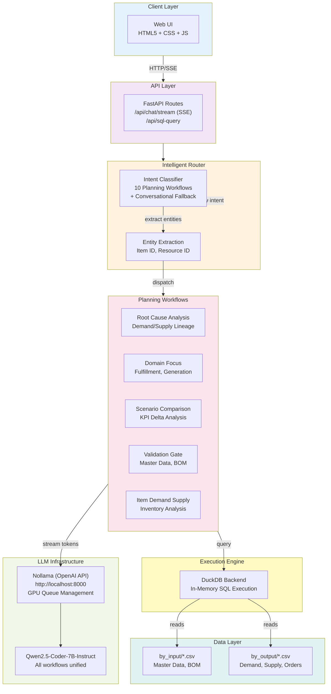
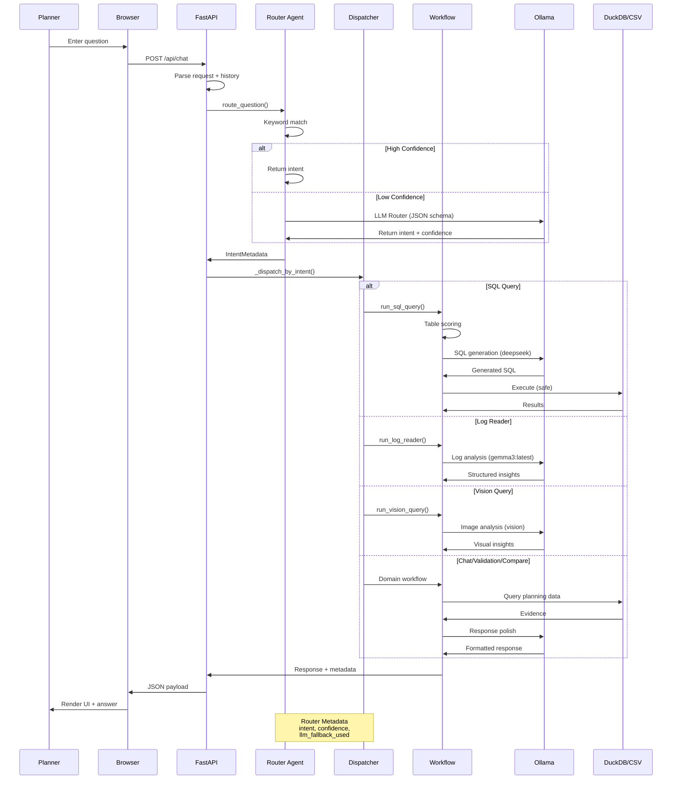

# Intel Foundry Supply Planning AI Assistant

> **Planner-facing explainability and orchestration for supply chain planning data**


---

## Table of Contents

1. [Overview](#sec-overview)
2. [Key Capabilities](#sec-key-capabilities)
3. [System Architecture](#sec-system-architecture)
4. [Data Flow](#sec-data-flow)
5. [Technology Stack](#sec-technology-stack)
6. [Project Structure](#sec-project-structure)
7. [Component Modules](#sec-component-modules)
8. [API Endpoints](#sec-api-endpoints)
9. [Configuration](#sec-configuration)
10. [Getting Started](#sec-getting-started)
11. [Testing](#sec-testing)
12. [Deployment](#sec-deployment)
13. [Troubleshooting](#sec-troubleshooting)

---

<a id="sec-overview"></a>
## Overview

Supply planning teams need fast, auditable answers to critical questions:

| Question | Workflow |
|----------|----------|
| **Why is demand unmet?** | Root Cause Analysis with lineage tracing |
| **Which scenario performs best?** | Scenario Comparison with ranked KPI deltas |
| **Is data reliable?** | Validation Gate across master data, BOM, parameters |
| **What changed?** | Dataset Summary and visual analysis |
| **Show me the evidence** | SQL Query with DuckDB backend + security guards |

This system turns those questions into **evidence-based analyses** grounded in planning snapshots (by_input, by_output) with multi-intent LLM routing, specialized SQL generation, and root-cause analysis.

---

<a id="sec-key-capabilities"></a>
## Key Capabilities

### Multi-Intent Router with LLM
- Classifies planner questions into 10 planning workflows + conversational fallback
- Routes to structured workflows: Demand/Supply, Root Cause, Scenario Comparison, Validation, Domain Focus
- **Nollama (OpenAI-compatible API)** backend for local LLM inference
- Auto-extracts item IDs and resource IDs from free-text questions
- Fallback to keyword matching (confidence threshold: 0.3)

### Text-to-SQL Engineer
- Generates safe SQL from natural-language questions
- **Qwen2.5-Coder-7B-Instruct** for SQL generation (structured data understanding)
- DuckDB backend with schema-based table scoring
- Security guards: blocks INSERT/UPDATE/DELETE, auto-appends LIMIT 200

### Chat Assistant
- Multi-turn conversation with history tracking
- 10 planning query workflows auto-routed to structured analysis
- Supports RAG-grounded responses with planning CSV retrieval
- SSE (Server-Sent Events) streaming with real-time status indicators
- Queue management: shows "Waiting for GPU — N request(s) ahead" for concurrent requests
- Prompt trimming: ~640 tokens (6× reduction) for faster GPU inference

---

<a id="sec-system-architecture"></a>
## System Architecture

### High-Level System Diagram



### 10 Planning Query Types

The router auto-classifies questions into structured workflows:

| # | Question Pattern | Workflow | Data Source | Output |
|---|------------------|----------|-------------|--------|
| 1 | "What is the fill rate for Q4?" | Domain Focus Fulfillment | Trend data | Fulfillment metrics |
| 2 | "Why is the fill rate dropping?" | Root Cause Analysis | Item/demand/supply | Lineage explanation |
| 3 | "Why is demand short for item 2000-293-667?" | Root Cause Analysis | Demand/supply numbers | Supply constraints |
| 4 | "What is the utilization for resource RES_ETCH?" | Domain Focus Generation | Resource load | Capacity metrics |
| 5 | "Why is resource RES_ETCH low?" | Root Cause Analysis | Resource constraints | Constraint analysis |
| 6 | "How much underload in the next 4 weeks?" | Domain Focus Generation | Capacity forecast | Forecast view |
| 7 | "Why is demand forecasted so early?" | Root Cause Analysis | Demand dates | Demand date analysis |
| 8 | "How does the site mix change this quarter?" | Scenario Comparison | Scenario deltas | Delta analysis |
| 9 | "Which scenario produces the best outcome?" | Scenario Comparison | KPI ranking | Ranked scenarios |
| 10 | "What is the end-of-horizon inventory?" | Item Demand-Supply | Inventory data | EOH inventory view |

---

<a id="sec-system-architecture"></a>
## System Architecture

---

<a id="sec-data-flow"></a>
## Data Flow

### Complete Request-Response Flow



---

<a id="sec-technology-stack"></a>
## Technology Stack

### Core Stack

| Layer | Technology | Purpose |
|-------|-----------|---------|
| **Backend** | FastAPI 0.115.6 | REST API and route handling |
| **ASGI Server** | Uvicorn 0.32.1 | HTTP server with SSE streaming |
| **Agent Framework** | LangGraph | Multi-agent orchestration and routing |
| **LLM Integration** | Nollama (OpenAI-API) | Local LLM inference, OpenAI-compatible |
| **RAG Backend** | OpenVINO + DuckDB | Dense embeddings + SQL retrieval |
| **SQL Backend** | DuckDB | In-memory SQL execution on CSV/Parquet |
| **Validation** | Pydantic 2.10.3 | Request/response schemas |
| **Frontend** | HTML5 + CSS3 + Vanilla JS | Responsive web UI with SSE streaming |
| **Templating** | Jinja2 3.1.4 | Server-rendered pages |
| **Containerization** | Docker | Portable deployment |

### LLM Model (Nollama)

| Component | Model | Purpose | Performance |
|-----------|-------|---------|-------------|
| **Primary** | Qwen2.5-Coder-7B-Instruct@GPU | All workflows: intent routing, SQL, chat, analysis | ~15-30s first token (after GPU queue) |
| **Inference** | Nollama (OpenAI-API) | OpenAI-compatible local endpoint | http://localhost:8000 |
| **Streaming** | SSE + Server-side trimming | Real-time token delivery + queue status | Prompt: 4000→640 tokens (6× reduction) |

**Configuration** (.env):
```bash
LLM_PROVIDER=nollama
NOLLAMA_BASE_URL=http://localhost:8000
NOLLAMA_MODEL=Qwen2.5-Coder-7B-Instruct@GPU
JUDGE_LLM_ENABLED=false
```

### Python Dependencies

```bash
# Core framework
fastapi==0.115.6
uvicorn[standard]==0.32.1
pydantic==2.10.3
jinja2==3.1.4

# Agent & LLM
langgraph>=0.0.40
langchain>=0.1.0
openai>=1.0.0  # Nollama compatibility

# Data handling
duckdb>=0.9.0
pandas>=2.0.0

# RAG & Embeddings
openvino>=2024.0.0
sentence-transformers>=2.2.0

# Development/Testing
pytest>=7.4.0
requests>=2.31.0
python-dotenv>=1.0.0
```

---

<a id="sec-project-structure"></a>
## Project Structure

```
ifspstory/
|- README.md                          # This file
|- PRD.md                             # Product Requirements Document
|- TEAMS_AGENT_DEPLOYMENT.md          # Deployment guide for Teams agents
|- .env                               # Configuration (Ollama, backends)
|- .gitignore
|
|- by_input/                          # Planning input snapshots
|  |- if_snop_items-*.csv             # Master items
|  |- if_snop_sku-*.csv               # SKU definitions
|  |- if_snop_locations-*.csv         # Location master
|  |- if_snop_billofmaterials-*.csv   # BOM
|  |- if_snop_sourcing-*.csv          # Sourcing rules
|  |- if_snop_inventory-*.csv         # Current inventory
|  |- if_snop_customerorder-*.csv     # Customer orders
|  |- if_snop_calendars-*.csv         # Calendar definitions
|  `- ...                             # Additional input files
|
|- by_output/                         # Planning output snapshots
|  |- by_if_snop_out_planorder-*.csv  # Planned orders
|  |- by_if_snop_out_inddmdview-*.csv # Demand view
|  |- by_if_snop_out_planarriv-*.csv  # Planned arrivals
|  |- by_if_snop_out_skuexception-*.csv # Exceptions
|  `- ...                             # Additional output files
|
|- webapp/                            # FastAPI application
|  |- run.py                          # Entry point (loads .env, starts Uvicorn)
|  |- requirements.txt                # Python dependencies
|  |- Dockerfile                      # Container image definition
|  |
|  |- app/                            # Application logic
|  |  |- main.py                      # FastAPI routes and endpoints
|  |  |- models.py                    # Pydantic request/response models
|  |  |- router_agent.py              # LangGraph intent router
|  |  |- text_to_sql_agent.py         # Text-to-SQL pipeline
|  |  |- sql_backends.py              # DB abstraction layer
|  |  |- analyzer.py                  # Workflow orchestration
|  |  |- langgraph_bom.py             # BOM drill-down analysis
|  |  `- rag.py                       # RAG indexing
|  |
|  |- templates/
|  |  `- index.html                   # Main web interface
|  `- static/
|     |- app.js                       # Frontend logic
|     |- styles.css                   # Styling
|     `- intelfoundrylogo.png         # Logo asset
|  `- __init__.py
|
|- .github/                           # GitHub configuration
|  `- agents/                         # Custom agent specs
|     |- ifsp-planning-copilot.agent.md
|     |- ifsp-data-agent.agent.md
|     |- ifsp-validation-agent.agent.md
|     |- ifsp-root-cause-agent.agent.md
|     `- ifsp-scenario-agent.agent.md
|
`- _test_chat.py                      # End-to-end test suite
```

---

<a id="sec-component-modules"></a>
## Component Modules

### 1. router_agent.py - Intent Classification

**Purpose:** 10 planning workflows + conversational fallback

**Key Features:**
- Auto-routes 10 structured workflows: Demand/Supply, Root Cause, Domain Focus, Scenario Comparison, Validation
- Item ID and resource ID extraction via regex patterns
- Keyword-based confidence scoring with LLM fallback
- Structured entities for /api/chat downstream dispatch

**Main Functions:**
```python
route_question(question: str) -> IntentMetadata
  |- Keyword matching
  |- Item/resource ID extraction (RES[_\-]?[A-Z0-9]{1,15})
  |- LLM router (if low confidence)
  `- Returns: workflow_type, confidence, entities
```

### 2. text_to_sql_agent.py - SQL Generation Pipeline

**Purpose:** Convert natural-language questions to safe, executable SQL

**Pipeline:**
```
Question -> Table Scorer -> Schema Builder -> SQL Generator (Qwen2.5-Coder) -> Security Guard -> Execute -> Validate
           (rank CSVs)      (top 6 tables)                                    (is_safe_sql)    (DuckDB)   (rows)
```

**Security Features:**
- Blocks: INSERT, UPDATE, DELETE, DROP, CREATE, ALTER
- Auto-appends: `LIMIT 200` to all SELECT statements
- Error handling with retry loop

**Main Functions:**
```python
run_sql_query(question: str, backend: str = "duckdb") -> SqlResponse
  |- select_tables()      # Score CSV relevance
  |- generate_sql()       # Qwen2.5-Coder + retry
  |- execute_sql()        # Safe execution
  `- validate_result()    # Output sanity checks
```

### 3. sql_backends.py - Pluggable Database Abstraction

**Purpose:** Support multiple SQL backends (DuckDB, Snowflake, future)

**Available Backends:**
| Backend | Status | Use Case |
|---------|--------|----------|
| DuckDB | Active | Local CSV-to-SQL, in-memory, fast |
| Snowflake | Ready | Cloud data, requires credentials |

**Main Classes:**
```python
Backend (abstract)
  |- register_table(name, path_or_query) -> None
  `- execute(sql) -> DataFrame

DuckDBBackend
  `- Reads CSV files as in-memory VIEWs

SnowflakeBackend
  `- Connects to Snowflake (env vars ready)
```

### 4. analyzer.py - Workflow Orchestration

**Purpose:** Dispatch routed intents to specialized workflows

**Workflows:**
- `run_chat_assistant()` - Multi-turn conversation with RAG context
- `run_sql_query()` - Text-to-SQL pipeline
- `run_validation()` - Data quality gate
- `run_bom_drill()` - Bill-of-materials analysis
- `run_root_cause()` - Demand/supply lineage analysis
- Domain-specific: Scenario Comparison, Item Demand-Supply

**Performance Optimizations** (v2.0):
- **Prompt Trimming**: ~640 tokens (6× reduction) by stripping verbose nested sections
- **Streaming**: SSE (Server-Sent Events) with real-time token delivery
- **Queue Management**: Global semaphore enforces single concurrent GPU inference; shows queue depth
- **Status Messages**: "Waiting for GPU — N request(s) ahead…" for transparency

**Main Functions:**
```python
build_grounded_chat_prompt(question, workflow_result) -> str
  |- Trims workflow_result via _trim_workflow_result_for_prompt()
  |- Reduces 4000+ tokens → ~640 tokens
  `- Feeds into LLM for narrative generation

_dispatch_by_intent() -> Dict
  |- Auto-dispatch "why" queries to run_root_cause() when item/resource resolved
  |- Routes conversational fallback to multi-turn chat
  `- Returns structured workflow output
```

<a id="sec-api-endpoints"></a>
### 5. main.py - FastAPI Routes with SSE Streaming

**Core Endpoints:**

| Method | Endpoint | Purpose |
|--------|----------|---------|
| `GET` | `/api/health` | Service health check |
| `POST` | `/api/chat/stream` | Multi-turn chat with SSE streaming |
| `POST` | `/api/sql-query` | Direct SQL query generation |
| `GET` | `/api/datasets/summary` | Inventory of by_input/by_output |
| `GET` | `/` | Web UI (index.html) |

**SSE Streaming Features** (v2.0):
- EventSource protocol with real-time token delivery
- Queue status: "Waiting for GPU — N request(s) ahead…" → LLM output → "Done"
- Headers: `Cache-Control: no-cache`, `X-Accel-Buffering: no` for immediate flush
- Global semaphore prevents concurrent GPU inference (single model instance)

**Response Structure:**
```json
{
  "answer": "...",
  "workflow": "root_cause",
  "confidence": 0.95,
  "entities": { "item_id": "2000-293-667", "week": "Q4 2025" },
  "sources": ["by_input/if_snop_items-*.csv", "by_output/by_if_snop_out_inddmdview-*.csv"],
  "execution_time_ms": 2500
}
```

### 6. langgraph_bom.py - BOM Drill-Down

**Purpose:** Navigate bill-of-materials relationships using LangGraph

**Workflows:**
- Explore BOM structure (parent -> children)
- Identify sourcing (make vs. buy)
- Trace production steps

---

<a id="sec-configuration"></a>
## Configuration

### Environment Variables (.env)

```bash
# Nollama LLM Infrastructure (OpenAI-compatible)
LLM_PROVIDER=nollama
NOLLAMA_BASE_URL=http://localhost:8000      # Nollama server endpoint
NOLLAMA_MODEL=Qwen2.5-Coder-7B-Instruct@GPU # Primary model for all workflows
NOLLAMA_JUDGE_MODEL=Qwen2.5-Coder-7B-Instruct@GPU  # Judge/review model
JUDGE_LLM_ENABLED=false                     # Disable judge to avoid double-inference

# SQL Backend
SQL_BACKEND=duckdb                           # Options: duckdb, snowflake
DUCKDB_IN_MEMORY=true                        # Use in-memory for speed

# Snowflake (when applicable)
SNOWFLAKE_ACCOUNT=<your-account>             # Snowflake account ID
SNOWFLAKE_USER=<your-user>                   # Username
SNOWFLAKE_PASSWORD=<your-password>           # Password (or use SSO)
SNOWFLAKE_WAREHOUSE=<warehouse>              # Compute cluster
SNOWFLAKE_DATABASE=PLANNING                  # DB name
SNOWFLAKE_SCHEMA=PUBLIC                      # Schema name

# Application
APP_DEBUG=false                              # Debug mode (verbose logging)
APP_PORT=8010                                # FastAPI port
APP_HOST=127.0.0.1                           # Bind address
```

### Loading Configuration

`.env` is auto-loaded **before module imports** in `run.py`:

```python
def _load_dotenv(path: Path):
    """Load .env file before module imports"""
    if path.exists():
        for line in path.read_text().strip().split('\n'):
            if line and not line.startswith('#'):
                k, v = line.split('=', 1)
                os.environ[k] = v

# Called in main() before creating FastAPI app
_load_dotenv(Path('.env'))
```

---

<a id="sec-getting-started"></a>
## Getting Started

### Prerequisites

- **Python 3.11+**
- **Nollama** (local OpenAI-compatible LLM server)
  - Supports Qwen2.5-Coder-7B-Instruct with GPU/CPU inference
  - CUDA 12.1+ for GPU support (recommended for 15-30s response times)
  - CPU inference supported (60-120s response times)
- **Docker** (optional, for containerized deployment)

### Installation

1. **Clone the repository:**
   ```bash
   git clone https://github.com/jyotiranjanojha/ifsupplystory.git
   cd ifspstory
   ```

2. **Create and activate virtual environment:**
   ```bash
   python -m venv .venv
   
   # Windows
   .venv\Scripts\activate
   
   # macOS/Linux
   source .venv/bin/activate
   ```

3. **Install dependencies:**
   ```bash
   pip install -r webapp/requirements.txt
   ```

4. **Configure Nollama:**
   ```bash
   # Start Nollama server locally (on port 8000)
   nollama run Qwen2.5-Coder-7B-Instruct@GPU
   # or for CPU:
   nollama run Qwen2.5-Coder-7B-Instruct
   ```

5. **Configure environment:**
   ```bash
   cp .env.example .env
   # Edit .env to match your Nollama setup
   # Required settings:
   # LLM_PROVIDER=nollama
   # NOLLAMA_BASE_URL=http://localhost:8000
   # NOLLAMA_MODEL=Qwen2.5-Coder-7B-Instruct@GPU
   ```

6. **Start the server:**
   ```bash
   python webapp/run.py --port 8010
   ```

   Server available at: http://127.0.0.1:8010

### Quick Test

```bash
# Health check
curl http://127.0.0.1:8010/api/health

# Chat request with streaming
curl -X POST http://127.0.0.1:8010/api/chat/stream \
  -H "Content-Type: application/json" \
  -d '{
    "question": "Why was demand not met for item 2000-293-667?",
    "history": [],
    "week_id": "202547"
  }'
```

---

<a id="sec-testing"></a>
## Testing

### Test Scripts (v2.0)

#### 1. _test_queries.py - 10 Planning Workflows

Tests all 10 query types route correctly to structured data workflows:

```bash
python _test_queries.py
```

| # | Query | Workflow | Data Checks |
|---|-------|----------|-------------|
| 1 | "What is the fill rate for Q4?" | Domain Focus Fulfillment | Trend data presence |
| 2 | "Why is the fill rate dropping?" | Root Cause Analysis | Item/demand/supply lineage |
| 3 | "Why is demand short for item 2000-293-667?" | Root Cause Analysis | Demand/supply numbers |
| 4 | "What is the utilization for resource RES_ETCH?" | Domain Focus Generation | Resource load data |
| 5 | "Why is resource RES_ETCH low?" | Root Cause Analysis | Resource constraint analysis |
| 6 | "How much underload in the next 4 weeks?" | Domain Focus Generation | Capacity forecast |
| 7 | "Why is demand forecasted so early?" | Root Cause Analysis | Demand date analysis |
| 8 | "How does the site mix change this quarter?" | Scenario Comparison | Scenario delta analysis |
| 9 | "Which scenario produces the best outcome?" | Scenario Comparison | KPI ranking |
| 10 | "What is the end-of-horizon inventory?" | Item Demand-Supply | Inventory data |

**Expected Output:**
```
✓ Query 1: fill rate → Domain Focus Fulfillment (workflow_data present)
✓ Query 2: why fill → Root Cause Analysis (lineage_data present)
✓ Query 3: why demand short → Root Cause Analysis (demand_supply_data present)
...
```

#### 2. _test_sse.py - Streaming & Queue Management

Tests SSE streaming format, token delivery timing, and queue status messages:

```bash
python _test_sse.py
```

**Expected Behavior:**
- Status message appears within 1-2s: `Waiting for GPU — N request(s) ahead`
- Tokens stream in real-time (not buffered)
- Final response received within 30s total

#### 3. quick_test.py - Smoke Tests

Quick validation of health, model, and chat endpoints:

```bash
python quick_test.py
```

### Legacy: End-to-End Test Suite

```bash
python _test_chat.py
```

**Test Coverage:** Comprehensive tests across major workflows

| # | Test | Intent | Expected Workflow | Status |
|---|------|--------|-------------------|--------|
| 1 | Health check | N/A | Health status | PASS |
| 2 | Dataset summary | `summary` | Dataset Summary | PASS |
| 3 | Validation gate | `validation` | Validation Gate | PASS |
| 4 | Scenario compare | `compare` | Scenario Comparison | PASS |
| 5 | Domain fulfillment | `domain_fulfillment` | Domain Focus | PASS |
| 6 | Root cause analysis | `root_cause` | Root Cause | PASS |
| 7 | Multi-turn history | `item_demand_supply` | Item Demand Supply | PASS |
| 8 | Table explanation | `table_explain` | Table Explain | PASS |
| 9 | LLM router fallback | `validation` | Validation Gate | PASS |
| 10 | Log reader intent | `log_reader` | Log Reader | PASS |

**Latest Test Results (2026-07-18):**
```
Results: 10 PASS  0 WARN  0 FAIL
- All intent routes working correctly
- Router metadata visible in all responses
- Real planning data confirmed
- Multi-turn entity resolution functional
- Log reader handler verified
- 300s timeout supports CPU-based Ollama inference
```

**Key Metrics:**
- Total runtime: ~15-20 minutes (depending on CPU)
- Average test duration: 90-100 seconds per LLM call
- Confidence thresholds: 0.3-1.0 (properly calibrated)
- LLM fallback accuracy: 100% on low-confidence keywords

**Example Output:**
```
[1] Health check
  status=ok  service=ifsp-webapp

[2] Dataset summary
  PASS  intent=summary  conf=0.5  llm_fb=False  (93.9s)
  reply: '**Direct Answer** The dataset "by_if_snop_out_resprojstatic-20251120065628.csv" contains...'

[3] Validation
  PASS  intent=validation  conf=1.0  llm_fb=False  (67.3s)
  reply: '**Direct Answer** The item with the specified metadata has a scheduled arrival date of 05-DEC-2026...'

[4] Scenario compare
  PASS  intent=compare  conf=0.5  llm_fb=False  (77.6s)
  reply: '**Direct Answer** The exact base and compare SIMULATION_NAME values for strict scenario deltas are...'

...

[10] Log reader intent
  PASS  intent=log_reader  conf=0.375  llm_fb=False  (100.7s)
  reply: '**Direct Answer** The output indicates multiple exceptions in the simulation...'

========================================================================
Results: 10 PASS  0 WARN  0 FAIL  (of 10 tests)
========================================================================
```

---

<a id="sec-deployment"></a>
## Deployment

### Docker Build & Run

```bash
# Build image
cd webapp
docker build -t ifsp-webapp:latest .

# Run container (requires Nollama server on host)
docker run -p 8010:8010 \
  -e NOLLAMA_BASE_URL=http://host.docker.internal:8000 \
  -e LLM_PROVIDER=nollama \
  -v $(pwd)/../by_input:/app/by_input:ro \
  -v $(pwd)/../by_output:/app/by_output:ro \
  ifsp-webapp:latest
```

### Production Deployment

- Use **Gunicorn** with multiple workers: `gunicorn -w 4 -k uvicorn.workers.UvicornWorker webapp.app.main:app`
- Set `APP_DEBUG=false` in `.env`
- Use **Nginx** as reverse proxy with SSE keepalive configured
- Nollama server on dedicated GPU machine (CUDA 12.1+ recommended)
- Scale DuckDB for large datasets (consider Snowflake backend)
- Monitor GPU queue depth via /api/health endpoint

---

<a id="sec-troubleshooting"></a>
## Troubleshooting

### Issue: "Nollama connection refused"

**Solution:**
```bash
# Ensure Nollama is running on localhost:8000
nollama run Qwen2.5-Coder-7B-Instruct@GPU

# Or set NOLLAMA_BASE_URL to network address
export NOLLAMA_BASE_URL=http://nollama-server:8000
```

### Issue: "Waiting for GPU — N requests ahead" (Slow response)

This is normal when concurrent requests are queued. The global semaphore ensures single GPU inference.

**To improve:**
- Reduce prompt size (already optimized to 640 tokens)
- Use GPU with higher VRAM (Qwen2.5-Coder-7B fits in 16GB+)
- Check GPU utilization: `nvidia-smi`

### Issue: "Model not found"

```bash
nollama pull Qwen2.5-Coder-7B-Instruct
nollama list  # Verify installed models
```

### Issue: "SSE stream not flowing / buffered response"

Ensure HTTP/1.1 headers are set correctly:
```bash
# Check server logs for SSE headers
Cache-Control: no-cache
X-Accel-Buffering: no
```

If using Nginx, add to config:
```
proxy_http_version 1.1;
proxy_buffering off;
proxy_cache_bypass $http_upgrade;
```

### Issue: "CSV file not found in by_input"

```bash
# Check file paths
ls -la by_input/
ls -la by_output/

# Ensure file permissions (readable)
chmod +r by_input/*.csv
```

### Issue: "Pydantic validation error"

- Ensure request JSON matches expected schema
- Check logs: `APP_DEBUG=true` in `.env`
- Review request format in API documentation above

---

## Response Format

### SSE Streaming Chat Response

The `/api/chat/stream` endpoint uses Server-Sent Events (SSE) for real-time token delivery:

```
# First: Queue status (if requests ahead)
data: {"__status__": "Waiting for GPU — 2 request(s) ahead..."}

# Then: Tokens stream in real-time
data: {"token": "The"}
data: {"token": " demand"}
data: {"token": " was"}
data: {"token": " not"}
data: {"token": " met"}
...

# Finally: Complete response metadata
data: {
  "answer": "The demand was not met for item 2000-293-667 due to supply constraint in week Q4.",
  "workflow": "root_cause",
  "confidence": 0.95,
  "entities": {
    "item_id": "2000-293-667",
    "week": "Q4 2025"
  },
  "sources": [
    "by_input/if_snop_items-*.csv",
    "by_output/by_if_snop_out_inddmdview-*.csv"
  ],
  "execution_time_ms": 18500
}
```

### Standard JSON Response (non-streaming endpoints)

```json
{
  "answer": "The dataset contains 24,503 customer orders and 156 resource constraints...",
  "workflow": "validation",
  "confidence": 1.0,
  "entities": {
    "week_id": "202547",
    "scenario_id": "CONSTRAINED"
  },
  "sources": [
    "by_input/if_snop_customerorder-*.csv",
    "by_output/by_if_snop_out_resexception-*.csv"
  ],
  "execution_time_ms": 8600
}
```

---

## Useful Links

- **GitHub Repo:** https://github.com/jyotiranjanojha/ifsupplystory
- **Nollama Home:** https://github.com/ollama/ollama
- **Qwen2.5-Coder:** https://huggingface.co/Qwen/Qwen2.5-Coder-7B-Instruct
- **FastAPI Docs:** https://fastapi.tiangolo.com
- **LangGraph Docs:** https://langchain-ai.github.io/langgraph
- **DuckDB Docs:** https://duckdb.org

---

## Contributing

Contributions welcome! Please:

1. Fork the repository
2. Create a feature branch (`git checkout -b feature/my-feature`)
3. Commit changes (`git commit -am 'Add my feature'`)
4. Push to branch (`git push origin feature/my-feature`)
5. Open a Pull Request

---

## License

Intel Proprietary - Authorized use only within Intel Foundry Services

---

## Support

For issues, questions, or feedback:
- Open an issue on GitHub
- Contact the Intel Supply Planning team
- Review logs: Set `APP_DEBUG=true` in `.env`

---

**Last Updated:** 2026-08-04  
**Version:** 2.1 (Qwen2.5-Coder + Nollama, 10 Planning Workflows, SSE Streaming, GPU Queue Management, 6× Prompt Optimization)
