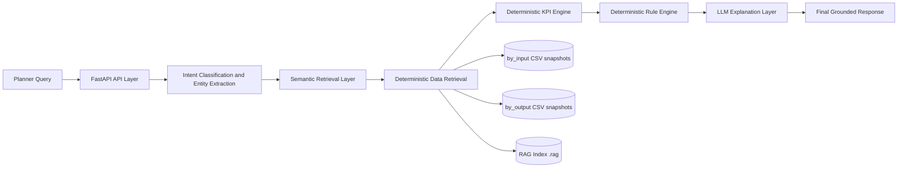
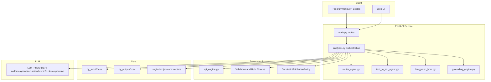
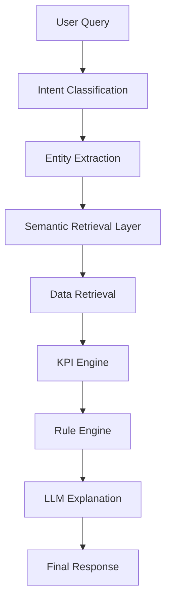

# Intel Foundry Supply Planning AI Assistant

[](https://github.com/jyotiranjanojha/ifsupplystory/actions/workflows/semantic-regression.yml)
[](https://github.com/jyotiranjanojha/ifsupplystory/actions/workflows/semantic-regression.yml)

Enterprise-grade explainability assistant for BY ESP planning snapshots.

This project helps planners ask natural-language questions and get grounded answers using deterministic planning calculations, rule-based checks, and LLM-based understanding/explanation.

## Project Overview

The assistant is designed for Intel Foundry supply planning workflows.

It supports:
- Demand and supply diagnosis
- Scenario comparison
- Root-cause explainability
- Validation gates for input and output data quality
- Knowledge graph and BOM traversal analysis
- Text-to-SQL exploration
- Optional RAG-backed evidence retrieval

Core principle:
- Deterministic engines compute business metrics and rules.
- LLMs classify intent, understand user language, and explain results.

## Architecture

### High-Level Architecture



### Runtime Components



## System Components

- API Layer: [webapp/app/main.py](webapp/app/main.py)
  - REST endpoints, streaming endpoint, auth/rate-limit middleware, runtime config diagnostics.
- Orchestration Layer: [webapp/app/analyzer.py](webapp/app/analyzer.py)
  - Main workflow routing, semantic retrieval plan generation, deterministic data operations, grounded response assembly.
- Intent Router: [webapp/app/router_agent.py](webapp/app/router_agent.py)
  - Intent catalog, slot/entity extraction, confidence handling, LLM fallback routing.
- Optional OpenVINO Intent Classifier: [webapp/app/intent_classifier.py](webapp/app/intent_classifier.py)
  - Strongly typed intent classification for override paths.
- Text-to-SQL Agent: [webapp/app/text_to_sql_agent.py](webapp/app/text_to_sql_agent.py)
  - LangGraph SQL pipeline with safety checks and retries.
- BOM Explainability Graph: [webapp/app/langgraph_bom.py](webapp/app/langgraph_bom.py)
  - Multi-step BOM traversal and evidence synthesis for shortage analysis.
- KPI Engine (Deterministic): [webapp/app/kpi_engine.py](webapp/app/kpi_engine.py)
  - Pure deterministic KPI calculations with explicit validation checks.
- Grounding Engine: [webapp/app/grounding_engine.py](webapp/app/grounding_engine.py)
  - Evidence envelope, citations, source table references, confidence mapping.
- RAG Index and Query: [webapp/app/rag.py](webapp/app/rag.py), [webapp/app/rag_openvino.py](webapp/app/rag_openvino.py)
  - Indexing and retrieval for planning evidence.
- UI: [webapp/app/templates/index.html](webapp/app/templates/index.html), [webapp/app/static/app.js](webapp/app/static/app.js)
  - Planner-facing interface, streaming statuses, module navigation.

## Data Flow

### End-to-End Workflow (Current Production Design)



Execution notes:
- Intent and entity extraction happen before workflow dispatch.
- The semantic retrieval plan is built before LLM explanation and persisted for audit.
- Data retrieval is deterministic from planning datasets.
- KPI calculations and rule checks are deterministic.
- LLM output is grounded using deterministic evidence and citations.

## Semantic Layer

The semantic layer is implemented in orchestration logic and produces an authoritative retrieval plan before LLM reasoning.

Plan includes:
- Normalized intent
- Extracted entities
- Required input files and output files
- Required columns and relationships
- Required KPIs
- Solver output targets
- Business rules
- Stage status markers for workflow progress

Audit persistence:
- Retrieval plans are appended to [.rag/audit/retrieval_plans.jsonl](.rag/audit/retrieval_plans.jsonl)

Startup governance:
- Single source of truth configuration: SEMANTIC_MODE
- Allowed values: legacy, semantic_retrieval, hybrid, solver_explainability
- Fail-fast validation on startup for missing, multiple, invalid, or deprecated mode flags

## Intent Classification

Intent classification combines:
- Rule and keyword catalog matching (router catalog)
- Entity extraction (item/site/week/scenario context)
- LLM-assisted fallback routing when confidence is low
- Optional OpenVINO intent override when enabled and above threshold

This ensures planner questions are routed to the right deterministic workflow before explanation.

## Semantic Retrieval Layer

The semantic retrieval layer performs pre-LLM planning.

Responsibilities:
- Identify relevant tables/files from semantic grounding
- Map relationships/linkages
- Surface KPI requirements
- Enforce business-rule context
- Produce retrieval plan with explicit stages

Important boundary:
- LLM is not the source of truth for file/column/join selection.
- Retrieval plan governs these decisions.

## Semantic Regression Framework

The repository includes a semantic regression gate designed to validate semantic behavior independently of the LLM layer.

Assets:
- Gold dataset: [tests/semantic/gold_semantic_dataset.json](tests/semantic/gold_semantic_dataset.json) (240 planner scenarios)
- Snapshot baseline: [tests/semantic/snapshots/semantic_snapshots.json](tests/semantic/snapshots/semantic_snapshots.json)
- Runner: [tests/semantic/run_semantic_regression.py](tests/semantic/run_semantic_regression.py)
- Dataset generator: [tests/semantic/generate_gold_dataset.py](tests/semantic/generate_gold_dataset.py)
- Deterministic evaluator: [webapp/app/semantic_regression.py](webapp/app/semantic_regression.py)

Gold dataset case schema:

```json
{
  "question": "",
  "expected_intent": "",
  "expected_entities": {},
  "expected_files": [],
  "expected_kpis": []
}
```

Scenario coverage includes:
- Inventory
- Forecast
- Capacity Constraints
- Solver Decisions
- Root Cause Analysis
- Recommendations

Metrics produced in reports:
- Pass Rate
- Intent Accuracy
- Entity Accuracy
- Semantic Retrieval Accuracy
- File Mapping Accuracy
- KPI Accuracy
- Relationship Accuracy
- Hallucination Rate
- Snapshot Pass Rate

Quality gates:
- Intent Accuracy must be >= 95%
- File Mapping Accuracy must be >= 95%
- KPI Accuracy must be >= 90%
- Hallucination Rate must be 0%

Run locally:

```bash
python tests/semantic/run_semantic_regression.py
```

Primary JSON quality report output:
- [reports/semantic_report.json](reports/semantic_report.json)

Run semantic pytest suite locally (same command used in CI):

```bash
pytest tests/semantic -rA
```

Update snapshots intentionally after approved semantic changes:

```bash
python tests/semantic/run_semantic_regression.py --update-snapshots
```

Generated reports:
- JSON: [reports/semantic_report.json](reports/semantic_report.json)
- HTML: [reports/semantic_report.html](reports/semantic_report.html)
- Snapshot Validation: [reports/semantic_snapshot_report.json](reports/semantic_snapshot_report.json)
- Coverage: [reports/semantic_coverage_report.json](reports/semantic_coverage_report.json)

Automated endpoint for semantic validation:
- [webapp/app/main.py](webapp/app/main.py) exposes `POST /api/semantic/debug`

How semantic testing works:
- Semantic tests in [tests/semantic](tests/semantic) validate intent expectations, entity expectations, and retrieval-plan expectations using the gold dataset.
- The framework gate in [tests/semantic/run_semantic_regression.py](tests/semantic/run_semantic_regression.py) executes deterministic semantic evaluation and enforces quality thresholds.
- Snapshot checks ensure semantic outputs remain stable unless intentionally updated.

How GitHub Actions validates the semantic layer:
- Workflow: [.github/workflows/semantic-regression.yml](.github/workflows/semantic-regression.yml)
- Triggers on pull requests and pushes to main/develop.
- Installs dependencies from [webapp/requirements.txt](webapp/requirements.txt), runs semantic regression gate, then executes `pytest tests/semantic`.
- Produces JUnit XML, console log, summary reports, and semantic quality report JSON/HTML; uploads all reports as artifacts.
- Publishes a GitHub Actions step summary with tests run/passed/failed and semantic quality metrics.
- Fails the workflow when semantic tests fail or when quality gates are breached:
  - Intent Accuracy < 95%
  - File Mapping Accuracy < 95%
  - KPI Accuracy < 90%
  - Hallucination Rate > 0%
- Fails the workflow if semantic snapshots change unexpectedly (unless snapshots are intentionally updated).

## LangGraph Workflow

LangGraph is currently used in two production paths:

1. Router graph (intent + slot flow)
- classify_intent -> resolve_entities -> check_slots -> end

2. SQL graph
- select_tables -> generate_sql -> execute_sql -> validate_result
- Automatic retry loop when SQL execution fails

3. BOM drill graph
- check_demand -> check_supply -> drill_bom loop -> synthesize

## Input and Output Data Sources

### Input CSV files (by_input)

Role:
- Master and policy inputs to the planning problem.
- Examples: items, locations, BOM, production methods, sourcing, inventory, customer orders, calendars.

Typical files:
- if_snop_items-*.csv
- if_snop_locations-*.csv
- if_snop_billofmaterials-*.csv
- if_snop_productionmethod-*.csv
- if_snop_sourcing-*.csv
- if_snop_inventory-*.csv

### Output CSV files (by_output)

Role:
- Solver-generated planning outcomes used for explainability.
- Examples: independent demand view, demand links, plan orders, plan purchases, resource loads, exceptions.

Typical files:
- by_if_snop_out_inddmdview-*.csv
- by_if_snop_out_inddmdlink-*.csv
- by_if_snop_out_planorder-*.csv
- by_if_snop_out_planpurch-*.csv
- by_if_snop_out_resloaddetail-*.csv
- by_if_snop_out_skuexception-*.csv

## BY ESP Planning System Integration

This assistant integrates with BY ESP outputs at the data and semantics level.

Integration model:
- Uses BY input and output snapshot datasets exported as CSV.
- Encodes BY planning domain guidance, table usage, and linkage logic in orchestration.
- Uses BY naming conventions (CAPTURE_WK, SIMULATION_NAME, ITEM, LOC, DMDITEM, SUPPLYITEM, etc.) for context resolution and joins.

Current integration scope:
- Read-only analytical and explainability workflows over BY snapshots.
- No direct write-back to BY ESP from this service.

## LP Optimizer (LpOpt) Integration

The system is aligned to BY ESP LP optimization outputs.

How LpOpt is represented:
- Solver behavior is interpreted through output datasets (demand/supply links, capacity loads, exceptions).
- Constraint reasoning is reconstructed via deterministic evidence analysis.
- Explanation focuses on objective and constraint implications from produced outputs.

This means:
- The assistant does not run the optimizer.
- The assistant interprets optimizer results in an auditable way.

## KPI Engine

Deterministic KPI calculation is implemented in [webapp/app/kpi_engine.py](webapp/app/kpi_engine.py).

KPI examples include:
- Inventory Coverage
- Inventory Turns
- Forecast Accuracy
- Fill Rate
- Service Level
- Safety Stock Gap
- Stockout Risk
- Customer Order Fulfillment
- Demand-Supply Ratio

Characteristics:
- Pure Python, no LLM dependency
- Formula-level transparency
- Output validation checks per KPI

## Rule Engine

Rule logic is deterministic and split across:
- Validation workflows in [webapp/app/analyzer.py](webapp/app/analyzer.py)
- Constraint attribution policy in [webapp/app/analyzer.py](webapp/app/analyzer.py)

Rule types include:
- Master data completeness checks
- Referential integrity checks
- BOM and route consistency checks
- Output sanity checks
- Constraint attribution signals (capacity, shortage, priority, setup risk, pegging mismatch)

## Recommendation Engine

Recommendation planning is supported through semantic recommendation retrieval planner prompts and deterministic evidence context.

Current behavior:
- Builds what-data-to-collect and what-rules/KPIs-to-evaluate plans.
- Final narrative recommendations are grounded by deterministic outputs and evidence.
- Avoids unsupported prescriptive claims when evidence is incomplete.

## RAG Components

RAG components include:
- [webapp/app/rag.py](webapp/app/rag.py): CSV indexing and retrieval
- [webapp/app/rag_openvino.py](webapp/app/rag_openvino.py): OpenVINO retrieval backend
- [webapp/app/retriever.py](webapp/app/retriever.py): chunk retrieval and citation builder
- [webapp/app/vector_store.py](webapp/app/vector_store.py): FAISS-backed vector storage

RAG outputs contribute:
- Evidence snippets
- Citations
- Table and document references
- Confidence enrichment

## API Endpoints

Current endpoints from [webapp/app/main.py](webapp/app/main.py):

| Method | Endpoint | Purpose |
|---|---|---|
| GET | /api/health | Service health |
| GET | /api/config | Runtime semantic mode/config diagnostics |
| GET | /api/auth/me | Authentication profile extraction |
| GET | /api/datasets/summary | Dataset inventory summary |
| GET | /api/llm/models | Available model list |
| GET | /api/rag/status | RAG status |
| POST | /api/rag/reindex | Build/rebuild RAG index |
| POST | /api/rag/query | Query RAG |
| GET | /api/rag/openvino/status | OpenVINO RAG status |
| POST | /api/rag/openvino/export-embedding | Export embedding model |
| POST | /api/rag/openvino/export-reranker | Export reranker model |
| POST | /api/rag/openvino/reindex | Build OpenVINO RAG index |
| POST | /api/rag/openvino/query | Query OpenVINO RAG |
| POST | /api/validate | Run validation checks |
| POST | /api/validate/report/html | Download validation report HTML |
| POST | /api/validate/report/email | Email validation report |
| GET | /api/email/smtp/health | SMTP health |
| POST | /api/compare | Scenario comparison |
| POST | /api/root-cause | Root-cause analysis |
| POST | /api/insights | Insights and KPI trends |
| POST | /api/knowledge-graph | Knowledge graph output |
| POST | /api/bom-drill | Multi-level BOM drill |
| POST | /api/sql-query | Natural language to SQL |
| POST | /api/vision-query | Image-based question analysis |
| POST | /api/chat | Non-streaming chat assistant |
| POST | /api/chat/stream | Streaming chat (SSE) |

## User Interface

The planner UI supports:
- Chat Assistant with optional week/scenario context
- Validation Gate
- Scenario Comparison
- Root Cause Analyzer
- Analytics Module
- Knowledge Graph
- Streaming statuses for grounding, queue wait, generation

UI source:
- [webapp/app/templates/index.html](webapp/app/templates/index.html)
- [webapp/app/static/app.js](webapp/app/static/app.js)

## Project Structure

```text
ifspstory/
  README.md
  .env
  .env.example
  PRD.md
  LLM_PROVIDER_GUIDE.md
  MULTI_PROVIDER_IMPLEMENTATION.md
  TEAMS_AGENT_DEPLOYMENT.md
  BY_ESP_QUERY_CATALOG.csv
  by_input/
  by_output/
  embedding_model/
  notebooks/
  docs/
  tests/
    conftest.py
    test_semantic_mode_config.py
    test_kpi_engine.py
    test_hybrid_router.py
    ...
  webapp/
    run.py
    requirements.txt
    app/
      main.py
      analyzer.py
      router_agent.py
      kpi_engine.py
      langgraph_bom.py
      text_to_sql_agent.py
      rag.py
      rag_openvino.py
      grounding_engine.py
      models.py
      templates/
      static/
```

## Installation

### Prerequisites

- Windows/Linux/macOS
- Python 3.11+
- pip
- Optional GPU stack for local OpenVINO/Nollama performance

### Setup

```bash
# from repository root
python -m venv .venv

# Windows PowerShell
.venv\Scripts\Activate.ps1

# macOS/Linux
source .venv/bin/activate

pip install --upgrade pip
pip install -r webapp/requirements.txt
```

## Configuration

Copy environment template and set required values.

```bash
# Windows PowerShell
Copy-Item .env.example .env

# macOS/Linux
cp .env.example .env
```

Minimum required settings:

```dotenv
LLM_PROVIDER=nollama
NOLLAMA_BASE_URL=http://localhost:8000
NOLLAMA_MODEL=Qwen2.5-Coder-7B-Instruct@GPU
SEMANTIC_MODE=legacy
```

Semantic mode rules:
- SEMANTIC_MODE is required.
- Exactly one value must be set.
- Allowed values: legacy, semantic_retrieval, hybrid, solver_explainability.
- Deprecated semantic flags must not be enabled with SEMANTIC_MODE.

Optional security controls:

```dotenv
API_AUTH_ENABLED=false
API_AUTH_TOKEN=
RATE_LIMIT_ENABLED=false
RATE_LIMIT_WINDOW_SECS=60
RATE_LIMIT_PER_WINDOW=120
RATE_LIMIT_STRICT_PER_WINDOW=30
```

## Running the Application

```bash
# from repository root, with virtual environment active
python webapp/run.py --port 8000
```

Notes:
- The runner auto-selects the first free port from the requested start port.
- LLM warm-up is attempted in a background thread for local providers.

Open browser:
- http://127.0.0.1:8000 (or selected port printed at startup)

Runtime config check:
- GET /api/config to verify active semantic mode and allowed modes.

## Testing

Run all tests:

```bash
pytest tests -q
```

Run specific groups:

```bash
pytest tests/test_semantic_mode_config.py -q
pytest tests/test_kpi_engine.py -q
pytest tests/test_hybrid_router.py -q
```

Current baseline in this workspace:
- 65 passed, 2 skipped

## Business Workflow and Explainability Framework

### Explainability Framework

The framework combines deterministic evidence and LLM explanation:
- Deterministic retrieval of relevant planning facts
- Deterministic KPI and rule evaluation
- Constraint analysis using structured policies
- LLM-generated plain-English explanation constrained by evidence

### Constraint Analysis

Constraint analysis derives causes from:
- Demand-supply mismatch
- Capacity exception signals
- Resource load and linkage evidence
- Competing demand and priority effects
- Setup/master-data readiness

### Solver Outputs

Solver outputs are treated as ground truth for:
- What plan was generated
- What demand was met, late, short, or unmet
- Which constraints and links were active

## Planner Query Examples (Updated)

- Why is demand short for item 100000000004 in week 2025W46 scenario S1?
- Show fill rate and unmet demand trend for site FAB34 for the last 4 workweeks.
- Compare scenario BASE vs ALT for week 2025W46 and rank KPI deltas.
- Which resource constraints contributed most to late demand for item 2000-293-667?
- Show end-of-horizon inventory and safety stock gap for product family X at site Y.
- Validate BOM traversal and production-route readiness for week 2025W46 scenario S2.

## Deterministic vs LLM Responsibilities

Deterministic engines are responsible for:
- Data selection and retrieval
- KPI calculations
- Rule evaluation and severity logic
- Constraint signal derivation

LLM layer is primarily responsible for:
- Understanding planner intent and phrasing
- Structuring or refining semantic planning payloads by mode
- Producing concise human-readable explanations grounded in deterministic evidence

## Troubleshooting

### Startup fails with SEMANTIC_MODE error

Symptoms:
- RuntimeError during app startup about missing/invalid/multiple semantic mode values.

Fix:
- Set exactly one valid SEMANTIC_MODE in .env.
- Remove deprecated semantic flags.

### /api/chat returns low-quality or generic responses

Checks:
- Confirm workflow data is available in by_input and by_output.
- Confirm context (week/scenario/site/item) is provided when needed.
- Check /api/rag/status and rebuild index if stale.

### LLM provider connectivity issues

Checks:
- Validate provider-specific env variables.
- Confirm local provider endpoint is reachable.
- Call /api/llm/models to inspect model availability.

### RAG retrieval appears empty

Checks:
- Run /api/rag/reindex.
- Confirm CSV files are present and readable.
- Verify top_k and context filters.

### SQL query fails

Checks:
- Query may refer to columns not present in selected tables.
- Use simpler phrasing and explicit context.
- Ensure generated SQL remains SELECT-only and safe.

### Streaming chat disconnects

Checks:
- Use /api/chat/stream over stable network path.
- Verify reverse proxy buffering is disabled for SSE if deployed behind proxy.

## Production Readiness Notes

- Semantic startup validation is fail-fast.
- Retrieval plans are audit-persisted.
- Deterministic engines carry business computation responsibility.
- Grounding layer packages evidence, citations, and confidence for explainability.
- Security middleware supports API key auth and configurable rate limiting.

## Additional Documentation

- [webapp/README.md](webapp/README.md)
- [docs/README.md](docs/README.md)
- [LLM_PROVIDER_GUIDE.md](LLM_PROVIDER_GUIDE.md)
- [MULTI_PROVIDER_IMPLEMENTATION.md](MULTI_PROVIDER_IMPLEMENTATION.md)
- [TEAMS_AGENT_DEPLOYMENT.md](TEAMS_AGENT_DEPLOYMENT.md)
- [PRD.md](PRD.md)
