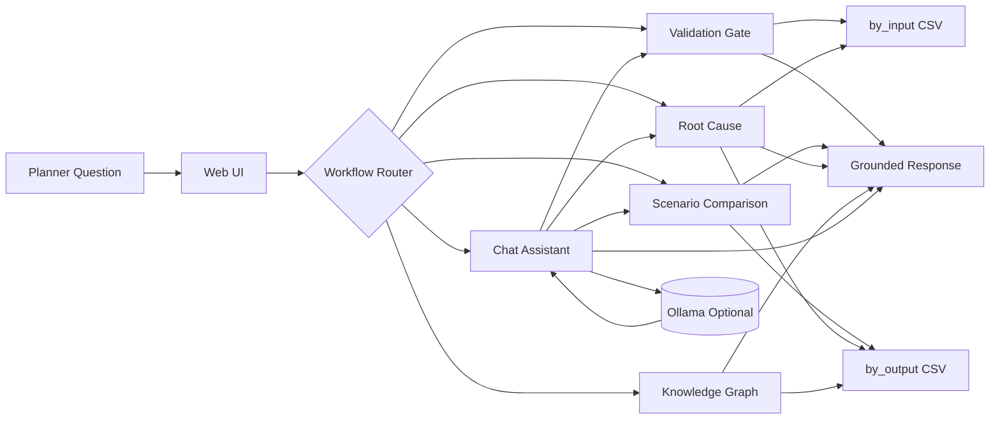
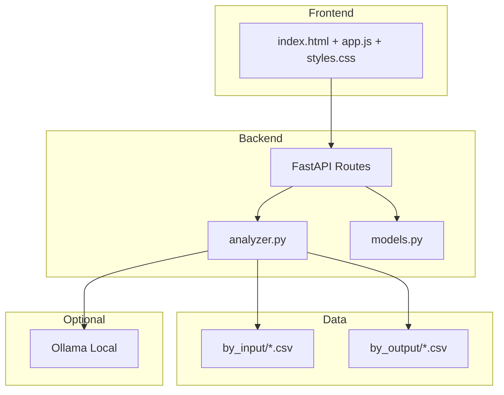

# IF Supply Story - IFSP Planning Copilot


Planner-facing explainability workspace for Blue Yonder ESP style planning data.

This repository provides:
- A multi-page web app for validation, scenario comparison, root cause analysis, and chat-style guidance.
- Local CSV-based analytics from `by_input/` and `by_output/` datasets.
- Optional Ollama integration for natural language response formatting while keeping core logic data-grounded.
- Agent definitions for IFSP workflow orchestration and specialist analysis patterns.

## 1) What Problem This Solves

Planning teams often need fast answers to questions like:
- Why was demand unmet for a specific item?
- Which scenario improved service levels and by how much?
- Are master data, BOM, and parameter tables valid before trusting plan outputs?

This project turns those questions into structured workflows with evidence-backed output.

## 2) Solution Overview



## 3) High-Level Architecture



## 4) Repository Layout

```text
ifspstory/
  .github/
    agents/
  by_input/
  by_output/
  webapp/
    app/
      analyzer.py
      main.py
      models.py
      static/
      templates/
    run.py
    requirements.txt
  PRD.md
  TEAMS_AGENT_DEPLOYMENT.md
```

## 5) Core Features

### 5.1 Validation Gate
- Checks master data quality and key consistency.
- Validates BOM and sourcing linkage integrity.
- Returns severity-based findings and readiness verdict.

### 5.2 Scenario Comparison
- Compares scenarios for selected scope.
- Ranks key metric deltas.
- Surfaces likely change drivers.

### 5.3 Root Cause Analysis
- Tracks unmet or met demand behavior for selected item context.
- Uses demand-supply and linkage evidence from BY output files.
- Separates confirmed findings from hypotheses.

### 5.4 Knowledge Graph
- Visual lineage map for item-centric investigation.
- Shows demand, supply, method, resource relationships.

### 5.5 Chat Assistant
- Supports plain-English questions.
- Multi-turn conversation flow with history.
- Calls structured workflows and returns planner-readable output.
- Can optionally use Ollama for natural language summarization.

## 6) Data Convention and Inputs

This project expects two top-level dataset folders:

- `by_input/`: planning input snapshots (items, BOM, sourcing, resource setup, etc.).
- `by_output/`: planning output snapshots (demand views, links, plan orders, exceptions, etc.).

### Data Filtering Dimensions
- `week_id` (optional in current local snapshot mode)
- `scenario_id` (optional in current local snapshot mode)
- `scope` (site, product, customer, node depending on workflow)

## 7) API Endpoints

| Method | Endpoint | Purpose |
|---|---|---|
| GET | `/api/health` | Service health check |
| GET | `/api/datasets/summary` | Input/output inventory summary |
| GET | `/api/llm/models` | Available Ollama models |
| POST | `/api/validate` | Validation workflow |
| POST | `/api/compare` | Scenario comparison workflow |
| POST | `/api/root-cause` | Root cause workflow |
| POST | `/api/knowledge-graph` | Graph nodes and edges for lineage view |
| POST | `/api/chat` | Chat orchestration with optional LLM summarization |

## 8) Run Locally

From repository root:

```bash
python -m venv .venv
.venv\Scripts\activate
pip install -r webapp/requirements.txt
python webapp/run.py --reload --host 127.0.0.1 --port 8011 --max-tries 20
```

Open:
- `http://127.0.0.1:8011`

### Alternative Start

```bash
uvicorn webapp.app.main:app --reload --host 127.0.0.1 --port 8000
```

## 9) Optional Ollama Setup

If Ollama is running locally, the chat assistant can produce more conversational responses.

Default environment assumptions:

```bash
OLLAMA_BASE_URL=http://127.0.0.1:11434
OLLAMA_MODEL=llama3.2:latest
```

If Ollama is unavailable, the application falls back to built-in grounded response formatting.

## 10) Example Questions

- Validate data for week 2026-W30 and scenario S2.
- Compare scenarios S1 vs S2 for unmet demand and lateness.
- Why is demand unmet for item 100000000008?
- Show knowledge graph for item 100000000004 at site X.

## 11) Deployment Options

### Docker

```bash
docker build -t ifsp-webapp -f webapp/Dockerfile .
docker run --rm -p 8000:8000 ifsp-webapp
```

### Cloud Targets
- Azure Container Apps
- Azure App Service (container)
- AKS / Kubernetes
- Any platform that can run a Python container

## 12) Agent Suite Included

The repository includes specialized agent definitions under `.github/agents/`:
- IFSP Planning Copilot (orchestrator)
- IFSP Data Agent
- IFSP Validation Agent
- IFSP Root Cause Agent
- IFSP Scenario Agent

These are intended to standardize explainability and validation workflows with clear guardrails.

## 13) Current Constraints

- Local CSV snapshots are used as the immediate source of truth.
- Week/scenario fields may be partially represented depending on snapshot content.
- Production-grade Snowflake retrieval and lineage service integration can be added by extending `webapp/app/analyzer.py`.

## 14) Next Improvements

- Add authenticated Snowflake connector path for enterprise retrieval.
- Add persistent chat sessions and exportable investigation reports.
- Add KPI trend dashboard and scenario drill-down pages.
- Add automated tests for endpoint contracts and root-cause regressions.

## 15) License and Internal Usage

Add your organization-approved license and data governance notes before broader distribution.
