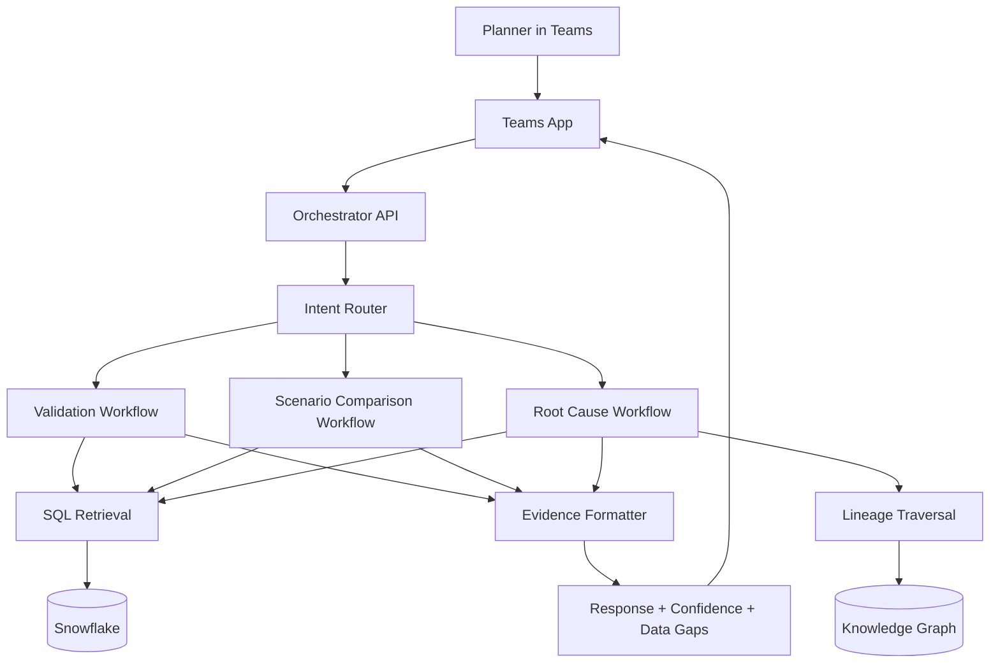

# IFSP Planner Access Without VS Code (Teams Deployment)

## Goal
Enable planners to use the IFSP Planning Copilot from Microsoft Teams, without opening VS Code.

## Recommended Target Architecture
1. Teams Client
2. Teams App (Bot + Message Extension)
3. Orchestrator Service (API)
4. IFSP Agent Runtime Layer
5. Data Access Layer (Snowflake + optional CSV/SharePath ingestion)
6. Audit and Observability

## Reuse What You Already Built
Use these existing assets as source prompts/instructions:
1. [.github/agents/ifsp-planning-copilot.agent.md](.github/agents/ifsp-planning-copilot.agent.md)
2. [.github/prompts/ifsp-validation-gate.prompt.md](.github/prompts/ifsp-validation-gate.prompt.md)
3. [.github/prompts/ifsp-scenario-comparison.prompt.md](.github/prompts/ifsp-scenario-comparison.prompt.md)

In the orchestrator, map Teams intents to these instruction sets.

## Teams User Experience (Planner Flow)
1. Planner asks: validate week and scenario.
2. Bot confirms missing identifiers (week, scenario, scope) before running checks.
3. Bot returns structured sections:
 1. Question Type
 2. Scope
 3. Evidence Used
 4. Findings
 5. Root Cause or Validation Result
 6. Confidence and Data Gaps
 7. Recommended Next Checks
4. Planner can click quick actions:
 1. Run Validation Gate
 2. Compare Scenarios
 3. Root Cause Drilldown

## Security and Governance Baseline
1. SSO via Microsoft Entra ID for Teams users.
2. Service principal or OAuth for Snowflake with least privilege.
3. Row/role-based access controls aligned to planner authorization.
4. Prompt and response logging with PII/secret redaction.
5. Trace IDs on each answer for auditability.
6. Explicit hypothesis labeling when evidence is partial.

## Data Contracts Required
Define and version a minimum schema contract for each dataset family:
1. Master Data: item, location, customer, resource.
2. BOM and alternates.
3. Supply/Demand inputs (forecast, orders, inventory, receipts).
4. Output datasets (planned supply, allocation, lateness, unmet demand).
5. Scenario metadata (week, scenario_id, run timestamp, planner owner).

## API Contract (MVP)
Create these endpoints in the orchestrator service:
1. POST /ifsp/validate
2. POST /ifsp/compare
3. POST /ifsp/root-cause
4. GET /ifsp/health

Example request payload fields:
1. week_id
2. scenario_id or base_scenario_id and compare_scenario_id
3. scope (site, product, customer, node)
4. focus_areas
5. user_context

## MVP Delivery Plan (4 Weeks)
1. Week 1: Teams app skeleton + orchestrator API + SSO + health endpoint.
2. Week 2: Implement validation workflow and Snowflake SQL retrieval.
3. Week 3: Add scenario comparison and root-cause workflows.
4. Week 4: UAT with planners, tune prompts, add guardrails and dashboards.

## Success Criteria
1. 80 percent of planner explainability requests answered in under 2 minutes.
2. 50 percent reduction in manual SQL effort for weekly explainability.
3. All answers include evidence references and confidence/data gaps.
4. No unsupported claims in production responses.

## Rollout Checklist
1. Confirm production Snowflake connectivity.
2. Confirm scenario metadata availability (week and scenario IDs).
3. Run security review and threat model.
4. Pilot with one planning pod.
5. Expand to all planners after KPI validation.

## Immediate Next Action
Build the orchestrator first and wire only one capability end-to-end:
1. Teams -> POST /ifsp/validate -> Snowflake -> structured response in Teams.

This gives fastest value and validates adoption before adding more workflows.
