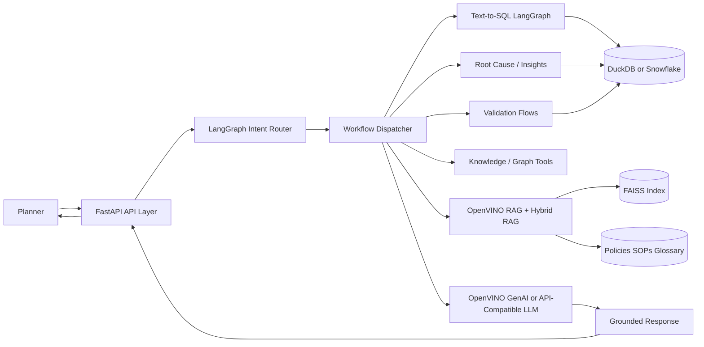
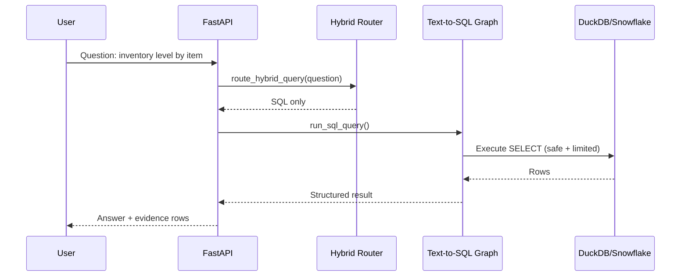
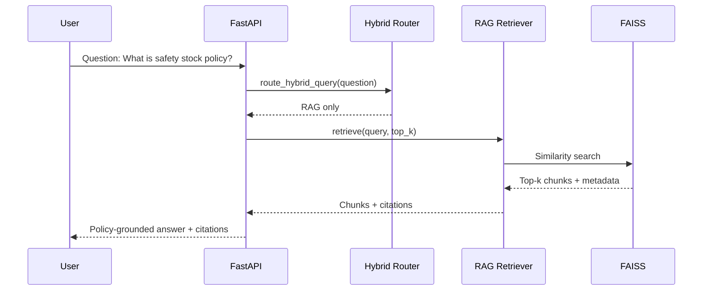
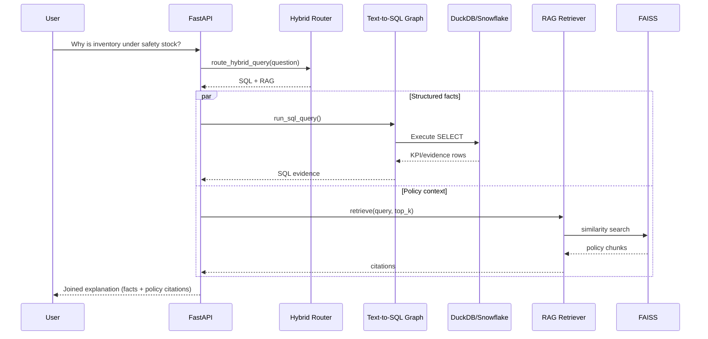
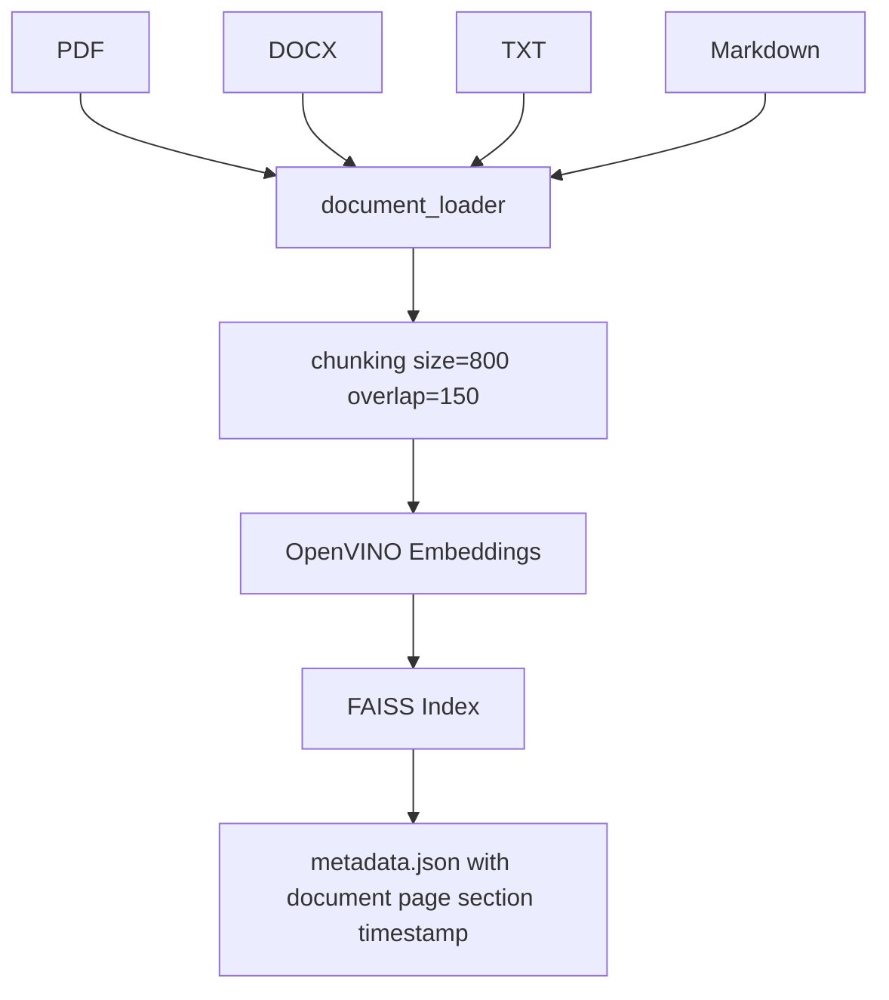
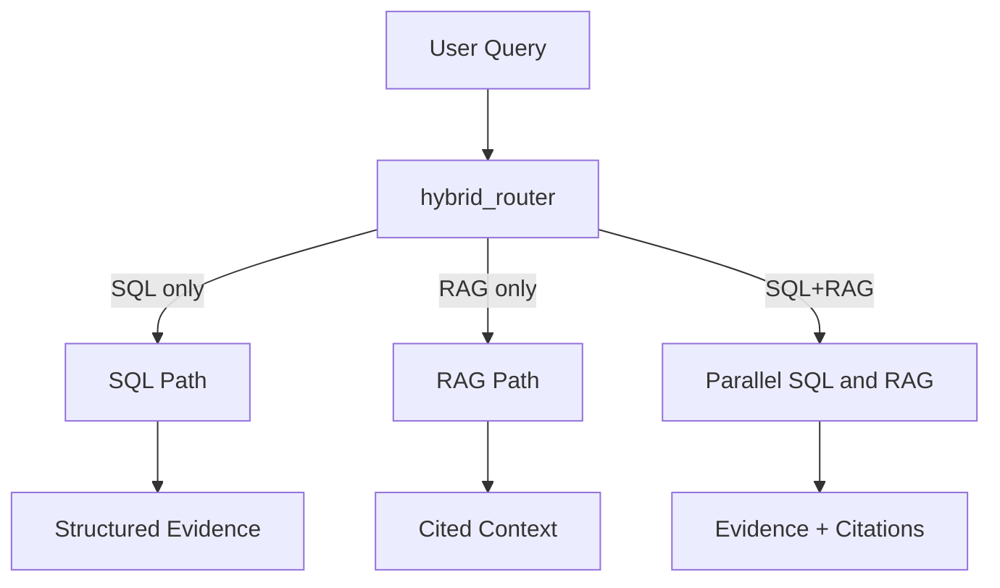

# IFSP Architecture Review

## Scope

Target runtime:
- Intel Ultra 7 AI Boost PC
- Qwen2.5-Coder-7B-Instruct
- OpenVINO GenAI
- Local-first architecture
- Enterprise-grade maintainability

System reviewed:
- FastAPI app and chat/stream endpoints
- LangGraph routers and workflow agents
- Text-to-SQL path (DuckDB + Snowflake backend abstraction)
- OpenVINO RAG and hybrid RAG modules
- Deterministic KPI engine and hybrid query router

## Executive Summary

Readiness summary by dimension:

| Area | Rating | Status Summary |
|---|---|---|
| Scalability | Medium | Single-process, single-semaphore inference gate protects GPU but caps throughput. |
| Security | Medium | SQL safety checks exist; missing strong authN/authZ enforcement and secrets hardening standards. |
| Snowflake Optimization | Medium | Backend abstraction exists; pushdown and warehouse/session tuning not yet fully productized. |
| OpenVINO Optimization | Medium-High | OpenVINO paths are implemented; need precision/device profiling and warmup strategy. |
| LangGraph Design | High | Clear graph boundaries and retry loops; needs stronger cross-graph observability contracts. |
| Resource Consumption | Medium | Good caching and prompt trimming; still vulnerable to large payload spikes and reindex bursts. |
| Memory Usage | Medium | Multiple in-process caches and JSON index structures; no global memory budget enforcement. |
| Prompt Design | Medium-High | Grounding prompt quality is strong; schema and citation constraints should be stricter by intent. |
| Hallucination Prevention | Medium-High | Grounded workflow-first path is solid; formal confidence and citation gates should be mandatory. |
| Maintainability | High | Modular growth is strong; needs docs governance and interface stability policy. |

Overall production posture:
- Development ready: Yes
- Controlled pilot ready: Yes, after P0 controls in checklist
- Enterprise production ready: Not yet; requires security and operations hardening

## Current Architecture

## Sequence Diagrams

### 1) SQL Only Query

### 2) RAG Only Query

### 3) SQL + RAG Query

## Data Flow Diagrams

### Ingestion Data Flow

### Query Data Flow

## Detailed Evaluation

### 1. Scalability

Strengths:
- Graph decomposition reduces monolith complexity.
- Cache usage on table catalogs, row reads, and indexes lowers repeated IO.

Gaps:
- Single-process semaphore serializes LLM generation and caps throughput.
- In-process state/caches limit horizontal scaling without shared cache.

Recommendations:
- P0: Add request budget controls (concurrent sessions, max prompt bytes, max output tokens).
- P1: Split API and inference workers; use lightweight queue for inference jobs.
- P2: Add multi-process worker model with sticky GPU executor.

### 2. Security

Strengths:
- SQL guard blocks destructive statements.
- Provider API key handling supports multiple auth header types.

Gaps:
- API endpoints are broadly open at app layer without mandatory RBAC gate.
- No default rate limiting or abuse throttling.
- Secrets lifecycle and rotation policy not codified.

Recommendations:
- P0: Enforce authenticated access for all state-mutating and high-cost endpoints.
- P0: Add per-user and per-endpoint rate limits.
- P1: Add secrets manager integration and rotation runbook.
- P1: Redact sensitive values from logs and telemetry payloads.

### 3. Snowflake Optimization

Strengths:
- Backend abstraction supports Snowflake drop-in.

Gaps:
- Query generation and table mapping are still DuckDB-first in many prompts.
- No formal warehouse sizing, auto-suspend, query tag, and result cache strategy.

Recommendations:
- P0: Add Snowflake query tags per intent/workflow.
- P0: Restrict SQL to approved views and schemas.
- P1: Push projection/filter down; avoid SELECT * patterns.
- P1: Add materialized semantic views for high-volume explainability joins.
- P2: Add telemetry of scanned bytes, execution time, cache hit ratios.

### 4. OpenVINO Optimization

Strengths:
- Native OpenVINO GenAI path is available for low-overhead local inference.
- OpenVINO embedding and reranker support exists for RAG.

Gaps:
- No systematic benchmark matrix (CPU/NPU/GPU, precision, batch size).
- Warmup strategy and adaptive token controls are not standardized.

Recommendations:
- P0: Benchmark matrix for Intel Ultra 7 AI Boost PC: device x precision x max_new_tokens.
- P0: Warm model and embedding pipeline at startup.
- P1: Enforce adaptive generation caps by intent class.
- P1: Add fallback cascade (NPU->GPU->CPU) with timeout thresholds.

### 5. LangGraph Design

Strengths:
- Router, SQL graph, and BOM graph are clear and composable.
- Retry loop in SQL graph improves reliability.

Gaps:
- Cross-graph output contracts are not uniformly versioned.
- Limited standardized trace IDs across graph hops.

Recommendations:
- P0: Define state contract schemas and version fields.
- P1: Add trace_id propagation through all node outputs.
- P1: Add graph-level SLIs (success rate, retries, median latency).

### 6. Resource Consumption

Strengths:
- Prompt trimming and queue signaling reduce GPU pressure.

Gaps:
- Reindex and heavy retrieval can spike CPU and memory in one process.
- Large response serialization can impact latency and memory.

Recommendations:
- P0: Set global hard caps for rows, docs, chunk count, top_k.
- P1: Move long-running index jobs to background task executor.
- P1: Stream large outputs with pagination.

### 7. Memory Usage

Strengths:
- Multiple caches reduce repeated reads.

Gaps:
- Caches are unbounded and process-local.
- No memory watermark monitoring.

Recommendations:
- P0: Add bounded LRU/TTL caches with max size controls.
- P1: Add memory watermark guardrails and eviction telemetry.

### 8. Prompt Design

Strengths:
- Grounded prompt explicitly separates context and instructions.

Gaps:
- Prompt contracts differ by workflow and may drift.

Recommendations:
- P0: Standardize prompt templates by route: SQL-only, RAG-only, SQL+RAG.
- P1: Add compact evidence schema blocks and mandatory citation section.

### 9. Hallucination Prevention

Strengths:
- Workflow-first grounding and deterministic KPI engine are strong controls.

Gaps:
- Citation requirement is not globally enforced for hybrid answers.
- Confidence labeling is inconsistent across flows.

Recommendations:
- P0: Enforce "no-citation, no-claim" for policy/process assertions.
- P0: Add confidence tiers and missing-evidence section in every answer.
- P1: Add claim-evidence consistency checks for final responses.

### 10. Maintainability

Strengths:
- Strong modular decomposition and expanding test coverage.

Gaps:
- Documentation growth is not governed by ownership and review cadence.

Recommendations:
- P0: Introduce architecture decision records (ADRs).
- P1: Add module owners and review checklist to PR template.
- P1: Track technical debt items with SLA.

## Performance Optimization Recommendations

Priority P0:
1. Add per-intent generation limits and timeout budgets.
2. Startup warmup for OpenVINO LLM + embeddings.
3. Enforce RBAC + rate limits on heavy endpoints.
4. Bounded caches and memory caps.
5. Snowflake query tags and approved-view allowlist.

Priority P1:
1. Background indexing workers and progress telemetry.
2. Structured tracing for all LangGraph nodes.
3. Intent-specific SQL templates before LLM SQL generation.
4. Mandatory citation gate for hybrid responses.

Priority P2:
1. Adaptive routing to NPU/GPU/CPU based on runtime pressure.
2. Optional response caching for repeated policy queries.

## Intel Ultra 7 AI Boost PC Deployment Guidance

Recommended local-first profile:
- Keep inference local with OpenVINO GenAI.
- Use OpenVINO embeddings + FAISS for document retrieval.
- Use DuckDB for offline mode; Snowflake when online and authorized.
- Route policy-only queries to RAG without LLM generation when possible.

Tuning baseline:
- Max new tokens by route:
  - SQL-only narrative: 220-400
  - RAG-only policy answer: 280-500
  - SQL+RAG explanation: 400-700
- Default top_k for RAG: 4-8
- Chunking: 800 / 150 overlap (already aligned)

## Documentation Produced for Production Hardening

This review is paired with:
- `PRODUCTION_READINESS_CHECKLIST.md`
- `RISK_REGISTER.md`
- `OPERATIONS_RUNBOOK.md`
