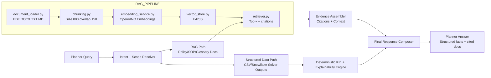
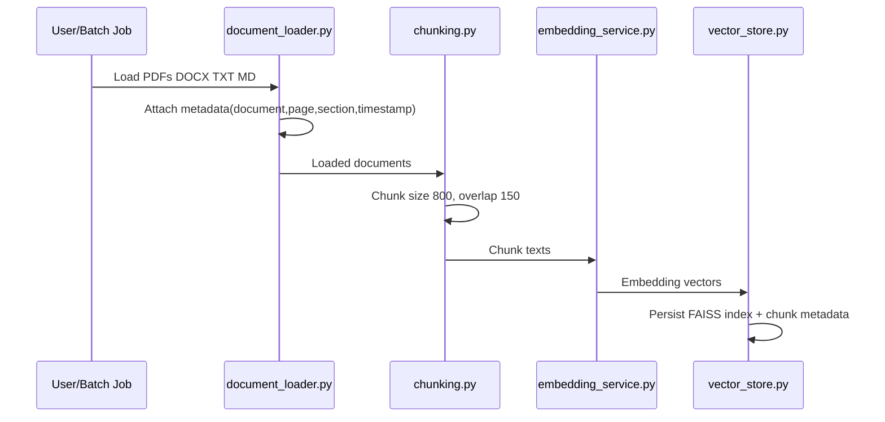
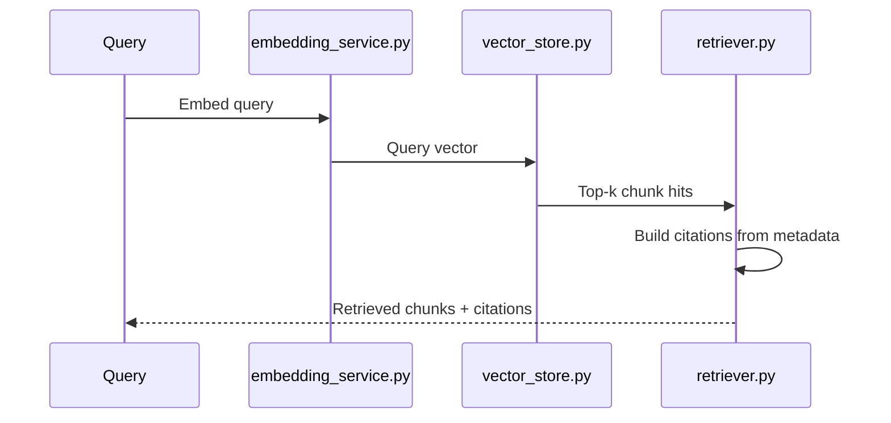

# Phase 2: Hybrid Structured Data + RAG Architecture

## Overview

This design combines deterministic structured-data workflows with document-grounded retrieval.

## High-Level Architecture

## Ingestion Flow

## Retrieval + Citation Flow

## Citation Format

Each retrieved chunk includes citation fields from metadata:
- document
- page
- section
- timestamp

Canonical citation string:

`<document> | page=<page> | section=<section> | ts=<timestamp>`
